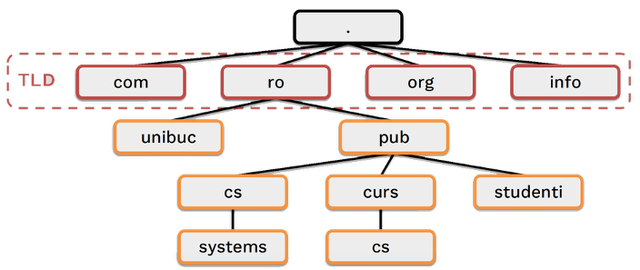

# Nivelul Aplicației: Protocoale uzuale (FTP, DNS, SSH, RDP)

---

## FTP – File Transfer Protocol

- Protocol de **transfer fișiere** bazat pe modelul **cerere–răspuns**.
- Funcționează peste **TCP**, folosind două canale:
  - **Canal de control** (pentru comenzi)

        - Conexiunea de control TCP este utilizată pentru deschiderea / închiderea unei sesiuni FTP și pentru transferul comenzilor de la client la server.
        
  - **Canal de date** (pentru transferul efectiv)

        - Conexiunea de date este utilizată pentru transferul fișierelor individuale între client și server. Fiecare transfer de fișiere utilizează o conexiune separată de date.

### Tipuri de moduri

- **Active mode** – clientul deschide un port și trimite comanda `PORT` -> se opreste in firewall la raspuns
- **Passive mode** – serverul deschide un port și clientul se conectează

- FTP foloseste protocolul NVT (Network Virtual Terminal) => cererile si raspunsurile ASCII incheiate dce un CRLF (\r\n)

- Comanda PORT indica serverului IP si numarul de port al conexiunii TCP a clientului pentru transferul de date

### Exemplu de comunicare (Active Mode)

```ftp
Client Request: PORT 192,168,1,15,5,91\r\n
Server Reply: 200 Port command successful.\r\n
```

### FXP

- FXP utilizeaza transferurile FTP pentru a tranfera direct fisiere intre doua servere FTP

- Transferul este controlat de un client FTP

- Viteza de transfer depinde exclusiv de conexiunea dintre servere, care este de obicei mai mare decât între client și server (o conexiune de viteză mică este suficientă pentru client).

#### Cum functioneaza FXP

1. Clientul deschide conexiunile de control la serverul FTP 1 și 2;
2. Clientul trimite comanda PASV către serverul 1. Serverul 1 răspunde cu adresa sa IP și numărul de port de conectare a datelor de ascultare (172,16,64,15,4,137). Serverul 1 deschide o conexiune de date pasivă (de ascultare) pe adresa IP specificată și numărul de port;
3. Clientul trimite comanda PORT către serverul 2 cu adresa IP și numărul de port returnat de serverul 1;
4. Clientul trimite comanda STOR <filename> (client încărcare → server) către serverul 1;
5. Clientul trimite comanda RETR <filename> (server de descărcare → client) către serverul 2. Aceasta face ca serverul 2 să deschidă conexiunea de date la IP / port specificat de comanda PORT anterioară (serverul 1). Deoarece serverul 1 este în modul pasiv, acceptă cererea de conectare, primește fișierul transferat prin conexiunea de date și îl stochează local.

---

## DNS - Domain Name System

- Adresele IP nu sunt adecvate pentru utilizatorii umani sa lucreze direc cu ele deoarece sunt numere greu de tinut minte si depind de organizarea fizica a retelei si se schimba

- DNS = Sistem ierarhic distribuit de asocieri de nume - adresa

- Serverul stocheaza informatiile numite inregistrari

- Clientii interogheaza server-ul pentru a afla valorile din inregistrari

### Exemplu de caz de utilizare DNS

- Care sunt adresele IPv4 si IPv6 ale lui cs.curs.pub.ro?

- Cine este 141.85.241.129?

- Ce IP are server-ul de email pentru domeniul pub.ro?

### ICANN

- Internet Corporation for Assigned Names and Numbers

- Administreaza o lista de TLD (Top Level Domains)

- Deleaga altor organizatii autoritatea de a aloca numele de domenii dintr-un TLD



- Pe aceasta structura functioneaza si DNS => Deleaga responsabilitatea de alocare si asociere prin numirea unor servere pentru o anumiza zona

### Tipuri de servere DNS

| Tip              | Descriere                                                                                                                                                                 |
|------------------|---------------------------------------------------------------------------------------------------------------------------------------------------------------------------|
| **Master / Slave**    | Ambele servere răspund cererilor DNS.                                                                                                                                    |
| **Server Forwarder**  | - Ajută alte servere DNS din rețeaua locală cu rezolvarea cererilor externe. <br> - Maschează serverele DNS locale. <br> - Reduce traficul extern prin caching. <br> - Primește cereri când serverul local nu este autoritar și nu are informația în cache. |
| **Caching-only**      | - Server autoritar doar pe domeniul `0.0.0.127` (adică `localhost`). <br> - Face caching pentru a reduce traficul DNS cu înregistrările cele mai frecvente.            |
| **Root Server**       | - Administrează TLD-uri (Top Level Domains) precum `.com`, `.org`, `.net`.                                                                                              |

> nslookup este un instrument in linie de comanda disponibil in multe sisteme de operare pentru interogarea sistemului de nume de domeniu (DNS) cu scopul de a obtine rezolvarea numelui de domeniu sau a adreselor IP sau alte inregistrari DNS

---

## SSH - Secure Shell

- SSH este un protocol care permite crearea unei sesiuni de lucru la distanta, transferul de fisiere si crearea unor canale de comunicatie pentru alte aplicatii

- Confidentialitatea transmisiei este asigurata prin criptare

- Autentificarea serverului se face prin criptografie asimetrică, serverul având o cheie secretă și clienții dispunând de cheia publică corespunzătoare;

- Autentificarea clientului se face fie prin criptografie asimetrică, ca și în cazul autentificării serverului (dar bineînțeles folosind altă pereche de chei), fie cu parolă clasică, dată de client după autentificarea serverului.


- SSH nu permite numai sesiuni de lucru prin rețea, ci și alte aplicații. Astfel, o dată deschis un canal securizat, pachetele vehiculate pot fi destinate mai multor aplicații, lista celor mai importante incluzând:
  - Sesiune de lucru (în mod text);
  - Transfer de fisiere (cunoscut și ca sftp sau scp);
  - Forward-area unor porturi TCP;
  - Forward-area unui server X (clientul SSH actionează ca server X pe mașina locală, dar cererile de la clienții X le forward-eaza serverului X de pe mașina server SSH);
  - Forward-area unui agent de autentificare.

---

## RDP - Remote Desktop Protocol

- RDP este un protocol propriu dezvoltat de Microsoft care ofera utilizatorului o interfata grafica pentru a se conecta la un calculator printr-o conexiune de retea

- Microsoft se referă în prezent la software-ul official al clientului RDP drept Remote Desktop Connection, anterior cunoscut ca Terminal Services Client.


