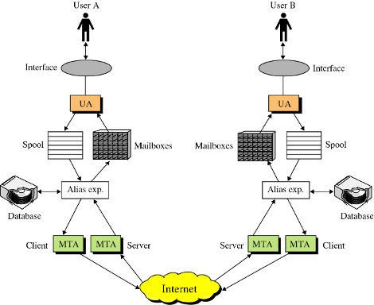

# Nivelul Aplicatie: E-mail (SMTP, POP, IMAP, WEBMAIL)

---

## SMTP - Simple Mail Transfer Protocol

- Protocolul standard de email care face parte din suita de protocoale de aplicatie din modelul TCP/IP

- SMTP definește formatul mesajului și agentul de transfer de mesaje (MTA), care stochează și redirecționează mesajele. SMTP a fost inițial conceput doar pentru text simplu (text ASCII), dar MIME și alte metode de codificare permit atașarea și transportarea programelor executabile și a fișierelor multimedia cu mesajul de poștă electronică;

### Scop

- Transferul de e-mail-uri intre server-ele de e-mail fiind esential si pentru clientii de e-mail

- Clientul trimite mesajul catre un server de e-mail de iesire -> contacteaza serverul de e-mail destinatie pentru livrare => Clientul trebuie configurat sa utilizeze un serviciu SMTP

- SMTP NU necesita autentificare

### Agenti SMTP

- **MUA (Mail User Agent)** – programul care compune e-mailuri (ex: Outlook, Thunderbird)
- **MTA (Mail Transfer Agent)** – programul care transmite și livrează e-mailuri între servere (ex: Postfix, Sendmail)

### Moduri de livrare a mesajelor

- **Comunicarea folosind releu** - informatiile de rutare sunt incluse impreuna cu adresa de e-mail
- **Comunicarea folosind DNS** - server-ele SMTP folosesc DNS pentru a rezolva adresa unde sa trimita

### Porti SMTP

- Sunt utilizate pentru transportul e-mailurilor folosind alt protocol decat SMTP

- După ce e-mailul a fost trimis de către MUA, acesta este stocat într-o coadă și apoi preluat de către MTA, care încearcă să-l trimită prin Internet către destinatar, astfel există o întârziere în trimiterea e-mailului pe partea server-ului.

- Când e-mailul ajunge în cele din urmă la server-ul destinatar, acesta este primit de către MTA al acelui server și stocat fie de sistemul de fișiere, fie într-o bază de date, înainte de a fi disponibil pentru ca MUA să îl poată prezenta și să îl prezinte utilizatorului.



### Mesaje si plicuri

1. Plic: informația necesară pentru transportul mesajului folosită în protocolul SMTP:
    - Adresa destinatarului;
    - Prioritatea;
    - Nivelul de Securitate.

2. Antet: informația de control pentru agentul utilizator:
    - Perechi cheie-valoare referitoare la utilizatori și la conținutul mesajului.

3. Corp: informația destinată utilizatorului:
    - Text sau multimedia.

### Stabilirea conexiunii

- Atunci când un client SMTP are un mesaj de transmis, acesta stabilește un canal de transmisie bidirecțional către un server SMTP. Responsabilitatea unui client SMTP este de a transfera mesaje de poștă electronică pe unul sau mai multe servere SMTP;
- O dată ce canalul de transmisie este stabilit și încheierea handshaking-ului inițial, clientul SMTP inițiază în mod normal o tranzacție prin poștă. O astfel de tranzacție constă dintr-o serie de comenzi pentru a specifica inițiatorul și destinația e-mail-ului și transmiterea conținutului mesajului (inclusiv orice antet sau altă structură).


---

## POP - Post Office Protocol

- Protocol Client - Server pentru primirea e-mail-ului

- Realizeaza o conexiune transparenta intre serverul de e-mail si clientul de e-mail (serviciu de stocare si redirectionare)

- Folosit in special pentru a descarca mesajele din inbox de pe server

- Asculta implicit portul 110

- Similar cu SMTP, comenzile asteapta un raspuns la fiecare pas

- Necesita autentificare

### Exemplu de sesiune POP

```bash
> telnet monte pop3
Trying 128.213.8.110...
Connected to monte.cs.rpi.edu (128.213.8.110).
Escape character is '^]'.
+OK POP3 monte.cs.rpi.edu v7.59 server ready
user joe
+OK User name accepted, password please
pass joepw
+OK Mailbox open, 1 messages
stat
+OK 1 412
list
+OK Mailbox scan listing follows
1 412
```

### Avantajele POP

- Putem citi posta electronica fara sa fim conectati la Internet

- Putem compune mesaje noi pentru a le transmite altora fara a fi conectat la internet

- Deschiderea atasamentelor esre rapida

- Mesajele sunt stocate pe hard-disk

---

## IMAP - Internet Message Access Protocol

- Protocol client - server de acces la email

- Permite accesare email-urilor pastrate pe un server de pe mai multe dispozitive

- Casuta postala poate sa fie accesata de catre mai multi utilizatori

- Este bazat pe TCP

### Procedura protocolului IMAP

- Toate e-mailurile sunt păstrate pe un server de e-mail;

- Funcționalitate:
  - Gestiunea pe server cât și locală a mesajelor;
  - Organizarea mesajelor în subdirectoare;
  - Descărcarea antetele mesajelor și ulterior mesajele complete;
  - Notificarea clientului la primirea de noi mesaje pe server.

- Etapele comunicării:
  - Inițializarea conexiunii;
  - Autentificarea cu serverul;
  - Interacțiunea dintre client și server;
  - Conexiunea este închisă.


```bash
S: * OK IMAP4rev1 Service Ready
C: a001 login rohit zealous
S: a001 OK LOGIN completed
C: a002 select inbox
S: * 18 EXISTS
S: * FLAGS(\Answered\Flagged\Deleted\Seen\Draft)
S: * 2 RECENT
S: * OK [UNSEEN 17] Message 17 is the first unseen message
S: * OK [UIDVALIDITY 3857529045] UIDs valid
S: a002 OK [READ-WRITE] SELECT completed
C: a003 fetch 12 body[header]
S: * 12 FETCH (BODY[HEADER] {350}
S: Date: Wed, 11 August 2010 02:23:25 -0700 (PDT)
S: From: rohit <rohit.rk.mishra@gmail.com>
S: Subject: weekend planning
S: To: rahul <rahul1234@gmail.com>
S: cc: bharat <igbharat@gmail.com>
S: Message-Id: <B27397-0100000@TIM01.de>
S: MIME-Version: 1.0
S: Content-Type: TEXT/PLAIN; CHARSET=US-ASCII
S:
S: )
S: a003 OK FETCH completed
C: a004 store 12 +flags \deleted
S: * 12 FETCH (FLAGS (\Seen \Deleted))
S: a004 OK +FLAGS completed
C: a005 logout
S: * BYE IMAP4rev1 server terminating connection
S: a005 OK LOGOUT completed
```

---

## WEBMAIL

- Este un serviciu de e-mail care utilizeaza un browser web pentru vizualizarea, trimiterea si primirea (editarea, stergerea) emailurilor de pe orice computer conectat la internet

- Utilizatorii pot beneficia de webmail in doua moduri:
  - Obtinerea accesului la emailurile actuate, indiferent de locatie si timp daca dispozitivul este conectat la Internet
  - Beneficiaza de multe conturi de email pentru mai multe persoana

### Avantaje

- Confidențialitate mai mare, deoarece webmail-ul nu are cache offline pentru e-mailuri;

- Schimbarea furnizorilor de servicii Internet nu va afecta conturile de e-mail permanente și deoarece e-mailurile pot fi accesate cu ușurință prin intermediul dispozitivelor conectate la Internet;

- Gestionarea mai eficientă a conturilor de e-mail dintr-o singură interfață;

- Funcții mai utile, cum ar fi atașamente, agende și răspunsuri automate în absență integrate cu interfața de e-mail.

## Protocoale e-mail: SMTP, POP3, IMAP, Webmail

| Protocol  | Scop principal                 | Folosit pentru            | Cine îl folosește | Avantaje                                         | Limitări                                          | Când îl folosesc?                         |
|-----------|--------------------------------|----------------------------|-------------------|--------------------------------------------------|--------------------------------------------------|-------------------------------------------|
| **SMTP**  | Trimiterea e-mailurilor        | Expediere (send)          | Client și server  | Rapid, standard universal, suport relay          | Nu stochează mesaje primite                      | Când trimit e-mail (ex: din Outlook)      |
| **POP3**  | Descărcare și ștergere e-mail  | Acces inbox (download)    | Client            | Mesajele sunt stocate local                      | Nu sincronizează între dispozitive               | Când folosesc un singur dispozitiv local  |
| **IMAP**  | Acces sincronizat la inbox     | Acces inbox (vizualizare) | Client            | Sincronizare completă între dispozitive          | Necesită spațiu server, mai lent decât POP       | Când accesez e-mailul de pe mai multe device-uri |
| **Webmail** | Interfață web (browser)      | Trimitere și primire      | Utilizator final  | Nu necesită instalare, accesibil oriunde         | Dependent de conexiune și browser                | Când folosesc Gmail, Outlook.com, Yahoo   |

---

### 🔁 Sumar

- **SMTP** – doar pentru trimitere (send).
- **POP3** – pentru descărcare locală și ștergere din inbox.
- **IMAP** – pentru sincronizare inbox între dispozitive.
- **Webmail** – aplicație web care combină tot (via browser).

> IMAP și POP3 au nevoie de autentificare.  
> SMTP poate necesita autentificare (SMTP AUTH), mai ales pentru trimitere de pe dispozitive externe.
