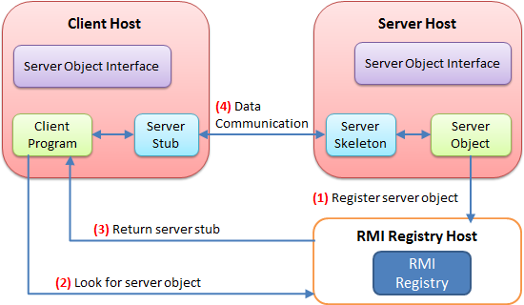

# Nivelul Aplicatie: RPC

- RPC = Remote Procedure Call

## Componentele unui Sistem de Servicii Distribuite

- **Componentele de serviciu**  
  Obiecte care implementează **contractele serviciilor**, adică logica funcțională expusă de sistem.

- **Aplicația client**  
  Permite **accesul utilizatorilor** la funcțiile oferite de componentele de serviciu aflate la distanță.

- **Proxy-ul client**  
  Acționează ca un **intermediar local**, facilitând **apelarea transparentă** a metodelor remote din aplicația client.

- **Mediul pentru execuția apelurilor procedurilor la distanță**  
  Se ocupă de **serializarea și deserializarea** mesajelor transmise prin rețea, atât pe partea de **client**, cât și pe **server**.

- **Invocatorul server**  
  Se ocupă cu **instanțierea dinamică** a componentelor de serviciu la momentul cererii și **executarea metodelor solicitate**, returnând rezultatul către client.

> Aceste componente lucrează împreună pentru a permite invocarea de metode între aplicații distribuite, într-un mod **transparent**, **modular** și **scalabil**.

- Tehnologiile RPC sunt: CORBA, XML-RPC / JSON - RPC, RMI, WFC, gRPC, SignalR

---

## RMI - Remote Method Invocation

- Permite publicarea prin intermediul unui registru de componete de serviciu a unor obiecte ale caror metode pot fi apelate la distanta prin intermediul unui invocator local, denumit `STUB` si a unui invocator pe server denumit `Skeleton`

### Avantajele RMI

- Transparenta localizarii serviciilor folosind registru RMI

- Scalabilitatea serviciilor publicate individual in container

- Incarcarea codului din client executat pe server

- Descarcarea dinamica a invocatorului serviciului

- Optimiza pentru transferul de date cu volum mare

### Dezavantajele RMI

- Necesită alocarea unui număr foarte mare de porturi;

- Blocarea invocărilor serviciilor din cauza politicilor firewall-urilor;

- Utilizarea unui format binar de serializare specific platformei Java;

- Suportă doar publicare singleton a serviciilor;

- Nu permite invocarea clientului înapoi din server.

---

## WCF - Windoes Communication Foundation

- Este suportul platformei .NET pentru remote function call

- Modelul WCF defineste serviciile prin intermediul:
  - Adresei URL de invocare
  - Binding-ului: modu de acces la serviciu incluzand protocolul de transport, stilul de codificare a mesajelor si politicii speciale de acces
  - Contractului de date si metode expus
  

- Contractul de date descrie fiecare parametru care alcătuiește fiecare mesaj pe care un serviciu îl poate crea sau consuma;

- Parametrii mesajului sunt definiți de documentele XML Schema Definition Language (XSD), permițând oricărui sistem care înțelege XML să proceseze documentele;

- Contractul de mesaje definește anumite părți ale mesajului folosind protocoale SOAP și permite un control mai fin asupra părților mesajului, atunci când interoperabilitatea necesită o astfel de precizie;

- Contractul de servicii specifică semnăturile metodei reale ale serviciului și este distribuit ca o interfață într-unul dintre limbajele de programare acceptate, cum ar fi Visual Basic sau Visual C#;

- Politicile și legăturile stipulează condițiile necesare pentru a comunica cu un serviciu. De exemplu, legarea trebuie (cel puțin) să specifice transportul utilizat (de exemplu, HTTP sau TCP) și o codificare. Politicile includ cerințe de securitate și alte condiții care trebuie îndeplinite pentru a comunica cu un serviciu.

## Avantajele WCF

- Cuplarea slabă prin utilizarea mesajelor XML;

- Accesibilitatea în Internet prin transportarea HTTP;

- Transparența localizării serviciilor folosind registrul UDDI;

- Posibilitatea apelării clientului înapoi în cazul cananelor duplex;

- Permite activări singleton, per-session sau per-call.

## Dezavantajele WCF

- Complexitatea ridicată a modelului de execuție;

- Limitat de modurile de comunicare specifice protocoalelor de transport;

- Performanță scăzută în cazul conversațiilor intensive;

- Performanță scăzută la transferul fișierelor de dimensiuni mari.

---

## gRPC

- Suport pentru dezvoltarea serviciilor si clientilor intr-o varietate mare de limbaje

- Foloseste protocol buffers pentru definirea contractelor componentelor de serviciu si a modelelor de date

- Permite comunicarea sincrona si asincrona bidirectionala peste HTTP2

- Un canal gRPC oferă o conexiune la un server gRPC pe o mașină gazdă și un port specificate. Se folosește la conectarea unui client la server. Clienții pot specifica argumente de canal pentru a modifica comportamentul implicit al acestuia, cum ar fi activarea sau dezactivarea compresiei mesajelor. Un canal are stare, inclusiv conectat și inactiv. Modul în care gRPC se ocupă de închiderea unui canal depinde de limbaj. Unele limbaje permit, de asemenea, interogarea stării canalului.

## Sumar comparativ – RPC

| Tehnologie | Platformă           | Tip apel          | Format date         | Cazuri de utilizare frecvente                  | Avantaje principale                                     | Limitări                     |
|------------|----------------------|-------------------|---------------------|------------------------------------------------|----------------------------------------------------------|------------------------------|
| **RMI**    | Java (JDK standard)  | RPC sincron       | Serializare Java    | Apeluri între aplicații Java distribuite       | Nativ în Java, simplu pentru proiecte locale             | Doar Java, performanță slabă |
| **WCF**    | .NET (Windows)       | RPC (SOAP, TCP)   | XML / binar         | Enterprise apps .NET, servicii Windows         | Suport multiple protocoale, configurabil                | Complex, doar Windows        |
| **gRPC**   | Cross-platform       | RPC sincron & async | Protocol Buffers   | Microservicii performante, backend-to-backend  | Foarte rapid, contract strict, suport multi-language     | Necesită generare cod, mai greu de testat manual |
| **SignalR**| .NET (ASP.NET Core)  | RPC asincron (real-time) | JSON / MsgPack  | Chat, notificări push, aplicații real-time     | Suport WebSockets, fallback HTTP, abstractizare completă | Doar pentru real-time, tightly coupled frontend-backend |
