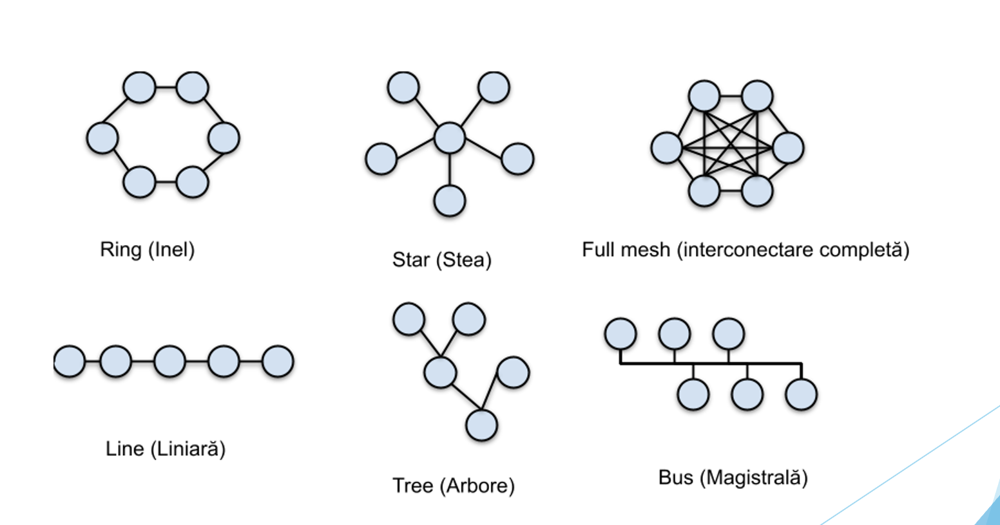

# General Concepts of Networking

## Rețeaua de calculatoare

- O rețea de calculatoare este un set de sisteme interconectate (de regulă computere).

- Comunicarea se face la 2 niveluri:

1. La nivel fizic
    - prin magistrale

2. La nivel logic
    - prin chipseturi

### Magistrale

- O magistrală (în engleză bus) este un set de fire sau canale care transportă date, adrese și semnale de control între diferite componente ale unui sistem de calcul.

- Magistrala face legătura la nivel fizic între CPU, memorie, plăci de extensie și alte periferice.

- Există mai multe tipuri de magistrale:
  - Magistrala de date – transportă datele efective.
  - Magistrala de adrese – transportă informații despre unde trebuie trimise sau citite datele.
  - Magistrala de control – transportă semnale de control pentru coordonarea activităților între componente.

- În contextul rețelelor, magistralele pot fi folosite și pentru a conecta mai multe calculatoare într-un tip simplu de rețea numită rețea magistrală (bus network), unde toate dispozitivele sunt conectate la un singur cablu comun.

### Chipseturile

- Un chipset este un ansamblu de circuite integrate de pe placa de bază a unui computer.

- Rolul unui chipset este să controleze comunicarea dintre componentele principale ale sistemului, cum ar fi procesorul (CPU), memoria (RAM), stocarea (SSD/HDD) și dispozitivele externe (placa de rețea, USB-uri etc.).

- În rețele, chipseturile de rețea gestionează trimiterea și primirea de date între computer și alte dispozitive conectate în rețea.

- Practic, chipsetul este ca un “dirijor” care coordonează fluxul de date în interiorul computerului și către exterior.

## Standarde în rețelele de calculatoare

1. Standardul IEEE

- Definește reguli tehnice pentru cum funcționează rețelele (ex: Ethernet, Wi-Fi) pentru a asigura compatibilitatea între echipamente.

2. RFC-uri

- Documente oficiale care descriu protocoale de rețea și bune practici (ex: cum funcționează TCP/IP, HTTP).

3. Standarde de programare (Berkeley Sockets)

- O metodă standardizată de programare a comunicației prin rețea, folosită în majoritatea sistemelor de operare.

## Dimensiunile unei rețele

- Într-un sistem de calcul, distanțele se măsoară în cm sau mm.

- Într-o rețea de calculatoare, distanțele se măsoară în metri.

- Rețelele de calculatoare pot fi:

1. LAN
    - Local Area Network
    - La nivel de clădire/etaj/cameră
    - Comunicarea se face pe baza Ethernet (IEEE 802.3) și WLAN (IEEE 802.11) sau Token Ring, Fiber Distributed Data Interfaces
    - Toate calculatoarele sunt conectate la același mediu de transmisie, fie din punct de vedere fizic și logic, fie doar logic

2. MAN
    - Metropolitan Area Network
    - La nivel de oraș

3. WAN
    - Wide Area Network
    - La nivel de regiuni/țară
    - Protocoale diverse MPLS, PPP, ATM, etc.
    - Grupează mai multe rețele LAN într-o rețea mai mare
    - Calculatoarele (end-userii) sunt în rețele / subrețele diferite
    - Transmiterea de informație se face prin rutarea pachetelor prin noduri de rețea specializate

4. Internet
    - La nivel planetar

## Topologia unei rețele de calculatoare

- Topologia reprezintă modalitatea de conectare a nodurilor unei rețele.

- Între două noduri o singură conexiune fizică este suficientă.

- Astăiz, conexiunea duplex (în ambele sensuri) este asigurată de cablurile de rețea care includ perechi de fire pentru comunicarea în ambele sensuri.

- Avem două tipuri de topologie:

1. Topologia fizică
    - Explică cum sunt conectate nodurile la nivel fizic

2. Topologia logică
    - Cum se transmit datele între noduri.

- Transmisia datelor între nodurile unei rețele poate fi punct-la-punct (un nod transmite doar către un alt nod) sau multipunct (un nod transmite către noduri multiple).

> Comutare la nivel fizic - se stabilește un canal rezervat de comunicație, disponibil pe toată durata acesteia (e.g. rețea telefonică)

## Dispozitive de comunicare în rețea

1. Placa de rețea (network adapter, NIC)
    - Permite nodului să comunice cu un alt nod din aceeași rețea, convertește informațiile în semnal pe care îl pune pe mediul de transmisie

2. Repetor
    - Amplifică semnalul

3. Hub
    - Retransmite semnalul tuturor nodurile conectate

4. Switch
    - Echivalentul unui hub inteligent, decide căror dintre nodurile conectate să transmită semnalul

5. Router
    - Conectează mai multe rețele de calculatoare

## Protocoale de comunicație

- Un protocol de comunicație este un set de reguli pentru comunicarea în rețea.

- Protocolul definește regulile de comunicație, sintaxa comenzilor și comportamentul așteptat al acestora.

- Protocoalele pot fi implementate și la nivel hardware și la nivel software.

## Stive de protocol

> O stivă de protocol este un set de protocoale proiectate să funcționeze împreună.

- **Scope:** Separarea comunicării în rețea în protocoale și stive de protocoale este complexitatea.

- Într-o stivă de protocoale, un protocol de nivel superior folosește protocoale inferioare => protocoalele de nivel inferior oferă servicii celor de nivel superior (*pe modelul moștenirii din OOP*).

- **Încapsulare:** Atunci când un protocol apelează la protocolul inferior pentru transmiterea de date, protocolul inferior va încapsula informația primită (fără a o procesa), în propria unitate de transfer.
