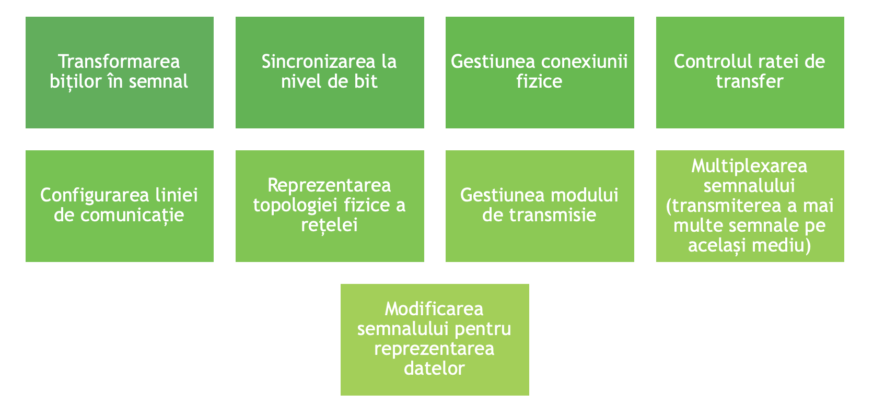

# Modelul OSI

- Modelul OSI permite oricăror două protocoale să comunice indiferent de arhitectura lor

- Descrie fluxul de date între două calculatoare care comunică în rețea.

- Fiecare strat din cele 7 descrie un element al comunicării în rețea

## Modelul OSI – Niveluri și Funcții

> **Modelul OSI** (Open Systems Interconnection) definește 7 niveluri de comunicare în rețelele de calculatoare, fiecare având un rol specific în transmiterea și procesarea datelor într-o rețea.

| Nivel | Nume                | Funcție principală                          | Implementat de                                 |
|:-----:|---------------------|---------------------------------------------|------------------------------------------------|
| 7     | Aplicație            | Comunicare între aplicații                  | Aplicațiile                                    |
| 6     | Prezentare           | Reprezentarea și conversia datelor           | Aplicațiile                                    |
| 5     | Sesiune              | Controlul sesiunilor de comunicare           | Aplicațiile                                    |
| 4     | Transport            | Controlul fluxului de date și integritatea   | Sistemul de operare                           |
| 3     | Rețea                | Determinarea căii către destinație           | Driverul plăcii de rețea și parțial sistemul de operare |
| 2     | Legătură de date     | Accesul la mediu și detectarea erorilor      | Driverul plăcii de rețea și parțial sistemul de operare |
| 1     | Fizic                | Transmisia efectivă a datelor pe suport fizic | Driverul plăcii de rețea                      |

### Nivelul Fizic

- Stă la baza modelului OSI.

- Asigură conectarea fizică dintre dispozitivele de rețea. Adică, transportul biților de la un nod de rețea la altul.

- Unitatea de transfer este bitul.



## Nivelul legătură de date

- Este responsabil cu transmiterea de chunckuri de la un nod la altul.

- Conține o schemă de adresare la nivel de dispozitiv fizic.

- Schema de adresare nu poate reprezenta ierarhii.

- Are două substraturi: *MAC* și *LLC*.

- Unitatea de măsură este frame-ul (chunckul transmis).

### Funcțiile nivelului legătură de date

```txt
Preluarea și împărțirea datelor de la rețea în frames / chunckuri
    ↓
    Adresarea fizică - adăugarea unui antet cadrului pentru a specifica adresele dispozitivelor sursă și destinație
        ↓
        Controlul fluxului
            ↓
            Controlul erorilor - utiliează CRC pentru a detecta erorile
                ↓
                Feedback - după transmiterea unui frame așteaptă confirmarea primirii
```

## Nivelul rețea

- Asigură transmiterea informației de la nodul sursă la nodul destinație.

- Introduce adrese ierarhice.

- Fragmentează pachetele de date prea mari.

- Unitatea de transfer este pachetul

### Diferența dintre nivelul legătură de date și nivelul rețea

- **Nivelul legătură de date** (Data Link) se ocupă cu **transmiterea datelor între două dispozitive direct conectate** în aceeași rețea (ex: două calculatoare în aceeași rețea LAN).  
  - Sparge datele în **frame-uri**.
  - Adresează dispozitivele fizice prin adrese **MAC**.
  - Asigură detectarea și corectarea erorilor locale.

- **Nivelul rețea** (Network) se ocupă cu **transmiterea datelor între rețele diferite**, de la sursă la destinație, indiferent câte rețele intermediare există.  
  - Sparge datele în **pachete**.
  - Adresează nodurile rețelei folosind adrese **IP** (adresare ierarhică).
  - Determină traseul optim de parcurs (routing).

> **Pe scurt:**  
>
> - Nivelul **legătură de date** mută date **pe o legătură fizică**.  
> - Nivelul **rețea** mută date **prin mai multe rețele** până la destinație.

## Nivelul transport

- Asigură transmiterea datelor de la procesul sursă (care rulează pe nodul sursă) la procesul destinație (care rulează pe nodul destinație).

- Introduce o schemă de adresare a unui anumit proces cu comunicare în rețea pe un anumit calculator (port).

- Oferă două feluri de servicii:
  - Transmiterea orientată pe conexiune a datelor (cu o serie de mecanisme suplimentare, cum ar fi confirmarea primirii datelor, mecanisme de asigurarea a calității serviciului etc.)
  - Transmiterea fără conexiune a datelor

## Nivelul sesiune

- Asigură începerea, menținerea și încheierea conversației între două noduri.

- Controlul dialogului - permite participanților la comunicație să intre într-un dialog de tip sesiune.

## Nivelul prezentare

- Asigură formatul de prezentare a informației venit de la aplicație.

- Responsabil de sintaxa informației.

- Realizează codificarea datelor
  - din formatul sursei în format canonic și invers.

- Criptează datele și se ocupă de compresia informației.

## Nivelul aplicație

- Implementează intefața cu utilizatorul.
