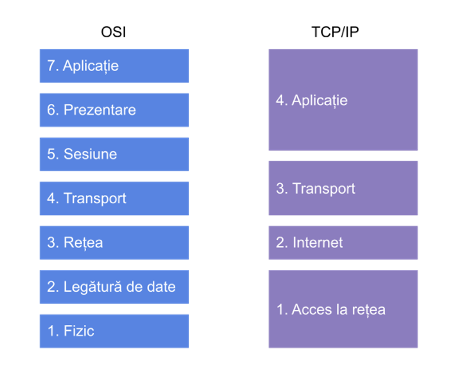

# Modelul TCP/IP

- Față de modelul OSI care este pur teoretic, modelul TCP/IP este nivelul efectiv al Internetului.

- Protocoalele TCP și IP sunt esențiale pentru acest model.

- Separarea protocoalelor TCP/IP pe straturi nu corespunde perfect straturilor OSI.

## Nivelurile TCP/IP

| Nivel | Nume              | Rol                                      |
|:-----:|-------------------|-----------------------------------------|
| 4     | Aplicație          | Controlul sesiunilor, Reprezentarea datelor, Comunicare între aplicații |
| 3     | Transport          | Controlul fluxului de date              |
| 2     | Internet           | Determinarea căii către destinație      |
| 1     | Acces la rețea     | Transmisia pe mediu, Accesul la mediu   |

## Nivelul Acces la rețea

- Cunoscut și ca nivel interfață de rețea.

- Asigură conectivitatea nodului la rețea.

- Acoperă straturile fizic și legătură de date din modelul OSI.

## Nivelul Internet

- Similar nivelului rețea din OSI.

- Asigură livrearea pachetelor IP de la sursă la destinație.

- Acoperă protocoale rutabile și de rutare.

- Protocolul fundamental este IP:
  - Neorientat pe conexiune
  - Nu ține evidența rutelor utilizate
  - Datele sunt împachetate în datagrame

## Nivelul Transport

- Similar cu nivelul transport din OSI, dar cu funcționalități suplimentare:
  - Permite adresarea unui proces prin porturi
  - Utilizează TCP sau UDP
  - TCP este orientat pe conexiune
  - UDP este neorientat pe conexiune

### TCP vs UDP

**TCP (Transmission Control Protocol)** și **UDP (User Datagram Protocol)** sunt cele două protocoale principale folosite la nivelul Transport din modelul TCP/IP.

| Caracteristică        | TCP                                   | UDP                                 |
|------------------------|--------------------------------------|-------------------------------------|
| Tip de conexiune        | Orientat pe conexiune (connection-oriented) | Fără conexiune (connectionless)     |
| Fiabilitate             | Asigură livrarea corectă a datelor   | Nu garantează livrarea datelor       |
| Control al erorilor     | Da (folosește mecanisme de retransmisie) | Nu                                 |
| Viteză                  | Mai lent (din cauza verificărilor)  | Mai rapid (nu verifică livrarea)     |
| Ordinea pachetelor      | Da, păstrează ordinea               | Nu garantează ordinea               |
| Dimensiune overhead     | Mare                                | Mic                                |

---

### Când folosim TCP?

- Când avem nevoie de **fiabilitate** și **corectitudine**:  

- Navigare pe web (HTTP/HTTPS)  
- Transfer de fișiere (FTP)  
- Email (SMTP, IMAP)

---

### Când folosim UDP?

- Când avem nevoie de **viteză mare** și putem tolera **pierderi minore** de date:  

- Streaming video sau audio live  
- Jocuri online  
- DNS (Domain Name System)

---

> **Pe scurt:**  
>
> - **TCP** = Alegem TCP când contează să **nu pierdem nicio informație**, de exemplu la **descărcarea unui fișier**, unde fiecare bit trebuie să ajungă corect.  
> - **UDP** = Alegem UDP când contează **viteza și fluiditatea**, de exemplu la **apeluri vocale** sau **videoconferințe**, unde pierderea unor mici pachete este mai bună decât a auzi ecouri sau întârzieri.

## Nivelul Aplicație

- O combinație între nivelurile sesiune, prezentare și aplicație din modelul OSI.

- Numărul de protocoale este nelimitat.

## Nivelurile OSI vs TCP/IP

