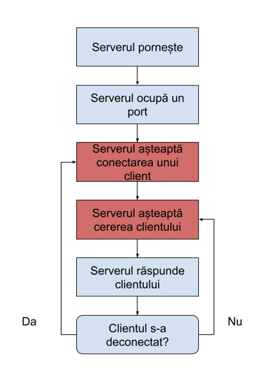

# Introducere în programarea aplicațiilor cu comunicare în rețea

## Abstracții peste nivelul aplicație

Uneori, aplicațiile folosesc protocoale de rețea existente (de nivel aplicație) nu doar pentru ce au fost ele gândite, ci și **ca un fel de „canal” de transport** între două puncte. Asta înseamnă "abstracție peste nivelul aplicație".

1. **Reprezentarea unor interacțiuni care folosesc protocoale de nivel aplicație în rol de canal de transport**  
   → Folosim un protocol de aplicație (ex: HTTP) nu doar ca să cerem pagini web, ci **ca să transportăm alte tipuri de date între două aplicații**. HTTP devine practic un "tunel" de comunicare.

2. **Ignoră protocoalele de sub nivelul aplicație**  
   → Atunci când folosim această abstracție, **nu ne mai interesează cum funcționează TCP, IP sau Ethernet** dedesubt. Lucrăm doar cu nivelul aplicație și vedem comunicația ca un schimb de mesaje prin protocolul ales.

3. **Cel mai cunoscut caz, utilizarea HTTP pentru accesul la obiecte la distanță**  
   → Exemplul clasic: **folosim HTTP** pentru a transfera date între două aplicații în loc să construim propriul protocol. De exemplu, API-urile web (REST APIs) folosesc HTTP pentru a transporta cereri și răspunsuri între client și server, chiar dacă nu este vorba de pagini web tradiționale.

---

> **Pe scurt:**  
> Abstracțiile peste nivelul aplicație înseamnă să folosim protocoale deja existente (ex: HTTP) **ca să facem comunicații între aplicații**, fără să ne intereseze ce se întâmplă sub ele (TCP/IP).

## Programarea la nivel transport

Programarea la nivel de transport în rețele înseamnă să gestionezi direct comunicațiile între două dispozitive folosind protocoale de nivel transport, cum ar fi TCP sau UDP.

- **Reprezentarea unei interacțiuni care folosește protocoale de nivel transport pentru canalul de comunicare**  
  → Aplicațiile folosesc TCP sau UDP ca un „tunel” direct de transmitere a datelor între două puncte, fără a adăuga neapărat alte protocoale de aplicație deasupra.

- **Servere custom care respectă specificațiile unui protocol de nivel aplicație**  
  → Se pot construi aplicații (servere) care folosesc TCP/UDP dar implementează reguli proprii, respectând convențiile unui protocol cunoscut (ex: un server HTTP custom, sau un server propriu de chat).

- **Alternativ, definirea de protocoale custom**  
  → Dacă nu folosim un protocol standardizat, putem inventa propriile reguli de comunicare între client și server (ex: să definim noi cum arată cererile și răspunsurile).

- **La baza programării la nivel transport stau Berkeley sockets**  
  → Tehnologia principală folosită pentru a programa la nivel transport este modelul **Berkeley Sockets**, care permite aplicațiilor să trimită și să primească date prin TCP sau UDP în majoritatea sistemelor de operare.

---

> **Pe scurt:**  
> La nivel transport, programarea înseamnă să controlezi direct comunicația prin TCP sau UDP, folosind Berkeley Sockets, fie construind pe protocoale existente, fie inventând propriile protocoale.

## Programarea cu Socket-uri

### Socket-ul

Un **socket** este un punct final al unei conexiuni de rețea.  

- În mod simplu, un socket este o **combinație de IP + Port** care permite comunicația între două dispozitive.
- Socketul definește:
  - Ce protocol folosim (TCP sau UDP)
  - Ce adresă IP și port sunt folosite
  - Cum trimitem și primim date

---

### Programarea cu socketi

- O aplicație **server** creează un socket și „ascultă” pe un port specific pentru conexiuni de la clienți.
- O aplicație **client** creează un socket și încearcă să se conecteze la server folosind adresa IP și portul serverului.
- Odată stabilită conexiunea, ambele părți pot trimite și primi date prin socketuri.

---

### Modele comune de socketi

| Model        | Descriere                                           |
|--------------|------------------------------------------------------|
| TCP Socket   | Crează o conexiune fiabilă între client și server     |
| UDP Socket   | Trimite pachete rapide fără a stabili o conexiune     |
| Raw Socket   | Permit accesul al alte protocoale                     |

---

> **Pe scurt:**  
> Un **socket** este ca un „tunel” controlat prin care aplicațiile comunică peste rețea. Programarea cu socketi înseamnă crearea, deschiderea, gestionarea și închiderea acestor tuneluri pentru a trimite date între calculatoare.

### TCP Socket

- Funcționează pe bază de conexiune.

- Un client poate face o cerere la un server doar după ce s-a conectat.

- Presupun operații blocante.

- În mod normal, serverul trebuie să termine comunicarea cu un client înainte de a putea răspunde altuia.  
- Pentru a permite serverului să gestioneze mai mulți clienți în paralel, **se folosesc thread-uri**.

---

> **Important:**  
>
> **Proces:** O unitate de execuție independentă, cu propriul spațiu de memorie, resurse și cod. Procesele nu partajează memoria între ele și comunică prin mecanisme speciale, precum IPC (*Inter-Process Communication*).
>
> **Thread:** O subunitate de execuție dintr-un proces. Thread-urile partajează memoria și resursele procesului părinte, fiind mai rapide pentru schimbul de date, dar și mai vulnerabile la probleme de sincronizare (ex: condiții de cursă).

---

#### Fluxul unui server TCP/IP



#### Demo comunicare TCP/IP: Client - Server

1. Server TCP/IP în Python

```python
import socketserver

class SimpleHandler(socketserver.BaseRequestHandler):
 def handle(self):
   self.data = self.request.recv(1024).strip()
   print("{} wrote:".format(self.client_address[0]))
   print(self.data)
   self.request.sendall(self.data.upper())

HOST, PORT = "localhost", 12345
with socketserver.TCPServer((HOST, PORT), SimpleHandler) as server:
   server.serve_forever()
```

2. Client TCP/IP în Python

```python
import socket

HOST = "127.0.0.1"
PORT = 12345

with socket.socket(socket.AF_INET, socket.SOCK_STREAM) as s:
   s.connect((HOST, PORT))
   s.sendall(b"Hello, world")
   data = s.recv(1024)

print(f"Received {data!r}")
```

#### Problemele comune ale serverelor TCP/IP

1. **Procesarea simultană a cererilor de la mai mulți clienți**  
   - În mod normal, un server TCP/IP procesează o conexiune la un moment dat.  
   - Dacă doi sau mai mulți clienți se conectează în același timp, serverul trebuie să fie capabil să gestioneze **fiecare conexiune separat**, fără să blocheze ceilalți clienți.  
   - Soluții tipice:
     - Folosirea **thread-urilor**: fiecare client este tratat de un thread separat.
     - Folosirea **proceselor**: serverul creează un nou proces pentru fiecare client.
     - **Modelul asincron**: serverul folosește evenimente pentru a procesa mai multe conexiuni în paralel, fără blocare.

2. **Comunicarea bidirecțională**  
   - Într-o conexiune TCP/IP, atât **clientul** cât și **serverul** trebuie să poată trimite și primi date în orice moment.  
   - Problema apare dacă serverul este construit să răspundă doar după ce primește complet toate datele: comunicarea devine lentă și neeficientă.  
   - Pentru o comunicare eficientă, serverul trebuie să fie capabil să:
     - **Primească cereri** de la client.
     - **Trimită răspunsuri** către client **independent** de alte operații.
   - Soluții tipice:
     - Folosirea **thread-urilor separate** pentru recepție și trimitere.
     - Folosirea **I/O asincron** sau **non-blocking sockets**.

---

> **Pe scurt:**  
> Serverele TCP/IP trebuie să învețe să răspundă la **mai mulți clienți în paralel** și să suporte **schimb de date în ambele direcții** în același timp, altfel vor bloca conexiunile și vor crea întârzieri.

### UDP Socket

- Funcționează fără o conexiune prealabilă.

- Orice client poate face o cerere la server în orice moment.

- Presupune operații blocante, dar serverul nu trebuie să termine comunicare cu un client înainte de a trece la următorul client.

- Nu necesită structuri de execuție separate.

#### Demo comunicare UDP: Client - Server

1. Server UDP

```java
import java.net.DatagramPacket;
import java.net.DatagramSocket;
import java.net.InetAddress;

public class UDPServer {
    public static void main(String[] args) {
        final int PORT = 3333;
        byte[] buffer = new byte[1024];

        try (DatagramSocket serverSocket = new DatagramSocket(PORT)) {
            System.out.println("UDP Server is running on port " + PORT);

            while (true) {
                DatagramPacket receivePacket = new DatagramPacket(buffer, buffer.length);
                serverSocket.receive(receivePacket);

                String message = new String(receivePacket.getData(), 0, receivePacket.getLength());
                String upperMessage = message.toUpperCase();

                byte[] sendBuffer = upperMessage.getBytes();
                InetAddress clientAddress = receivePacket.getAddress();
                int clientPort = receivePacket.getPort();

                DatagramPacket sendPacket = new DatagramPacket(sendBuffer, sendBuffer.length, clientAddress, clientPort);
                serverSocket.send(sendPacket);
            }
        } catch (Exception e) {
            e.printStackTrace();
        }
    }
}
```

2. Client UDP

```java
import java.net.DatagramPacket;
import java.net.DatagramSocket;
import java.net.InetAddress;
import java.util.Scanner;

public class UDPClient {
    public static void main(String[] args) {
        final String HOST = "127.0.0.1";
        final int PORT = 3333;
        byte[] buffer = new byte[1024];

        try (DatagramSocket clientSocket = new DatagramSocket();
             Scanner scanner = new Scanner(System.in)) {

            InetAddress serverAddress = InetAddress.getByName(HOST);

            while (true) {
                System.out.print("Please enter the message:\n");
                String data = scanner.nextLine();

                byte[] sendBuffer = data.getBytes();
                DatagramPacket sendPacket = new DatagramPacket(sendBuffer, sendBuffer.length, serverAddress, PORT);
                clientSocket.send(sendPacket);

                DatagramPacket receivePacket = new DatagramPacket(buffer, buffer.length);
                clientSocket.receive(receivePacket);

                String receivedMessage = new String(receivePacket.getData(), 0, receivePacket.getLength());
                System.out.println("Server response: " + receivedMessage);
            }

        } catch (Exception e) {
            e.printStackTrace();
        }
    }
}
```

## Problemele comune ale serverelor UDP

Serverele UDP se confruntă cu probleme specifice din cauza naturii nesigure și fără conexiune a protocolului UDP.

### Probleme principale

- **Menținerea unei comunicații multi-cerere cu un anumit client**  
  UDP nu ține evidența conexiunilor. Serverul trebuie să gestioneze manual ce cereri aparțin fiecărui client, folosind adresa IP și portul de origine.

- **Confirmarea primirii comenzilor**  
  UDP nu garantează livrarea pachetelor. Dacă serverul așteaptă comenzi importante de la client, trebuie implementat un mecanism propriu de confirmare (de exemplu, clientul trimite un ACK - acknowledgment).

- **Comunicare bidirecțională**  
  Chiar dacă UDP permite trimiterea și recepționarea de date, serverul trebuie să gestioneze manual cine trimite și cine primește, pentru că nu există o conexiune stabilă ca la TCP.

---

> **Pe scurt:**  
> Serverele UDP trebuie să implementeze manual logica pentru **urmărirea clienților**, **confirmarea livrării** și **gestionarea schimbului de date în ambele direcții**, pentru că UDP nu oferă aceste funcționalități în mod automat.

## Programarea sub nivelul transport

- Trimiterea de pachete IP construite în interiorul aplicației.

### Raw Socket

Un **Raw Socket** îți permite să trimiți pachete de rețea **direct la nivel IP**, fără ca sistemul de operare să adauge automat anteturi TCP sau UDP.

- Creezi **manual** structura pachetului (IP Header, eventual Data).

- Sistemul de operare nu mai construiește pentru tine pachetul de transport.

- Ai **control complet** asupra modului în care arată pachetul trimis.

#### Use case-uri

- Testare de protocoale.

- Analiză de rețea și sniffing.

- Simulare de atacuri sau vulnerabilități (ex: crearea manuală de pachete malformate).

### Crearea de pachete cu Scapy

**Scapy este o bibliotecă Python** care te ajută să construiești și să trimiți pachete de rețea fără să scrii manual fiecare byte.

- Exemple:
  - Creare de pachete la nivel 2 (Ethernet) sau nivel 3 (IP):
  - Nivel 2: comunicație directă prin adrese MAC (LAN).
  - Nivel 3: comunicație prin adrese IP (WAN, Internet).
  - Utilizarea protocoalelor preexistente:
  - Scapy știe cum să creeze pachete IP, TCP, UDP, ICMP, ARP etc.
  - Poți construi rapid o structură corectă de pachet fără să scrii fiecare câmp manual.
  - Crearea de pachete personalizate:
  - Dacă este cazul, putem să definim complet manual conținutul pachetelor.

## Sumar - UDP vs TCP/IP

| UDP   |   TCP/IP  |
| ----- | --------- |
| Nu este orientat pe conexiune - fiecare mesaj este trimis individual  | Este orientat pe conexiune - necesită stabilirea unei conexiuni   |
| Nu garantează livrarea pachetelor | Garantează livrarea și ordinea pachetelor |
| Este mai rapid decât TCP pentru că nu are mecanisme de validare | Este mai lent decât UDP pentru că are mecanisme de validare |
| Util pentru aplicații în timp real | Folosit pentru aplicații critice, unde integritatea este importantă |
