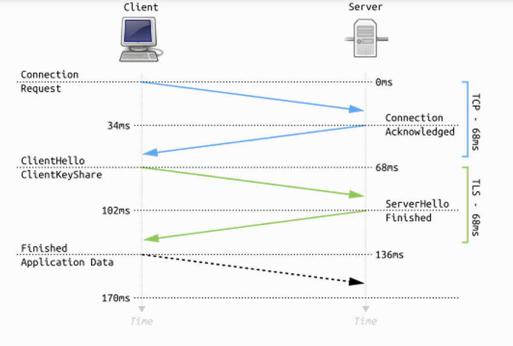
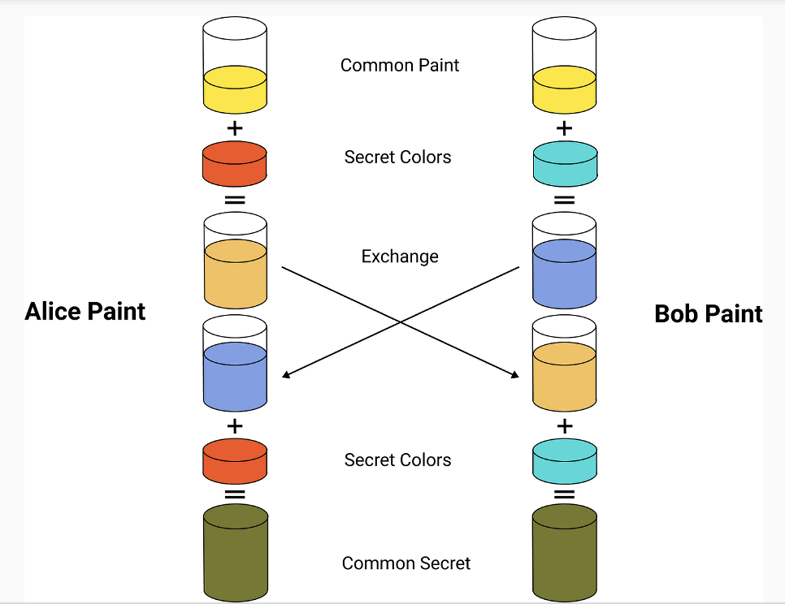
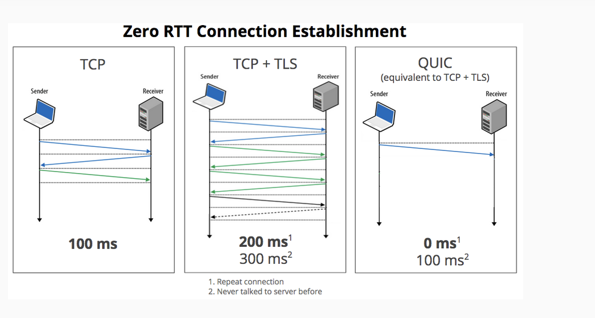

# Nivelul Transport

## Rolul nivelului transport

1. **Identificarea unui anumit proces care rulează pe un calculator care comunică în rețea.**  
   - Nivelul transport adaugă **numere de port** pentru a diferenția aplicațiile de pe același calculator.
   - De exemplu, browserul folosește portul 443 pentru HTTPS, iar o aplicație FTP poate folosi portul 21.

2. **Asigurarea comunicării de la proces la proces.**  
   - Nivelul transport stabilește o conexiune sau o sesiune între două aplicații care rulează pe sisteme diferite.
   - Nu doar între calculatoare, ci **între aplicații** de pe acele calculatoare.

3. **Controlul fluxului de date.**  
   - Se gestionează cât de repede sunt trimise datele pentru a evita supraîncărcarea receptorului.
   - Mecanisme ca **ferestrele de control** (ex: sliding window) ajustează volumul de date transmis.

4. **Detectarea și corectarea erorilor.**  
   - Nivelul transport poate detecta dacă pachetele sunt pierdute sau corupte și cere retransmiterea lor.
   - Exemple: TCP folosește numere de secvență și recunoașteri (acknowledgments) pentru verificare.

5. **Fragmentarea și reasamblarea mesajelor.**  
   - Datele mari sunt împărțite în bucăți mai mici (segmente) și trimise separat.
   - La destinație, nivelul transport reasamblează segmentele în mesajul complet.

---

> **Pe scurt:**  
> Nivelul transport face posibilă comunicarea directă între aplicații aflate pe sisteme diferite, controlând fluxul, detectând erorile și, dacă e necesar, asigurând fiabilitatea transmisiei.

## Porturi

Un **port** este o **intrare virtuală** prin care un calculator identifică aplicațiile care comunică pe rețea.  
Fiecare aplicație care vrea să trimită sau să primească date prin rețea trebuie să folosească un număr de port.

> **Adresarea completă pe rețea:**  
> `Adresă IP + Număr Port` → identifică exact o aplicație activă pe un dispozitiv.

---

### Categorii de porturi

1. **Porturi bine cunoscute (Well-known Ports)**  
   - Porturile cu numere de la **0 la 1023**.  
   - Sunt **rezervate** pentru servicii standardizate, bine cunoscute.  
   - Exemplu:
     - Port 80 → HTTP (pentru navigare web)
     - Port 443 → HTTPS (navigare securizată)
     - Port 25 → SMTP (trimitere email)
     - Port 21 → FTP (transfer fișiere)
     - Port 22 → SSH (conexiune securizată la distanță)

2. **Porturi registrate (Registered Ports)**  
   - Porturile între **1024 și 49151**.  
   - Pot fi folosite de aplicații obișnuite.  
   - Exemplu: servere custom, aplicații proprii, baze de date etc.

3. **Porturi dinamice/efemere (Dynamic/Ephemeral Ports)**  
   - Porturile între **49152 și 65535**.  
   - Folosite automat de sistemele de operare pentru conexiuni temporare (ex: când browserul deschide o sesiune TCP către un server).

---

### Cum sunt folosite porturile?

- **Serverele** ascultă de obicei pe un port fix (ex: serverul web ascultă pe portul 80).
- **Clientul** folosește un port dinamic aleator pentru a iniția conexiunea.
- Sistemul de operare gestionează maparea între conexiunile active și porturile folosite.

---

### Exemplu concret

| Serviciu       | Protocol | Port standard |
|-----------------|----------|---------------|
| HTTP            | TCP      | 80            |
| HTTPS           | TCP      | 443           |
| SMTP (email)    | TCP      | 25            |
| FTP (transfer fișiere) | TCP | 21          |
| SSH (remote secure) | TCP | 22           |

---

> **Pe scurt:**  
> Porturile sunt esențiale pentru ca mai multe aplicații să poată comunica simultan printr-o singură conexiune de rețea (IP). Porturile sub 1024 sunt rezervate pentru servicii bine definite, iar celelalte sunt disponibile pentru orice aplicație.

## Protocolul TCP

**TCP (Transmission Control Protocol)** este un protocol orientat pe conexiune, utilizat pentru a asigura o comunicare fiabilă între două puncte dintr-o rețea.

### Caracteristici principale ale TCP

- **Protocol orientat pe conexiune**: stabilește o conexiune logică între client și server înainte de schimbul efectiv de date.
- **(Relativ) complex**: comparativ cu alte protocoale (ex: UDP), TCP are o logică internă complexă pentru controlul fluxului și verificarea erorilor.
- **Oferă garanții suplimentare**: confirmarea primirii datelor, ordonarea datelor și retransmiterea pachetelor pierdute.
- **Dezavantaj minor**: raportul între dimensiunea header-ului și datele transmise poate fi relativ dezavantajos, în special pentru mesaje mici.

---

### Header-ul TCP

Header-ul TCP adaugă informațiile necesare pentru a controla și monitoriza conexiunea.  
Un header TCP standard are minimum **20 de bytes** și conține mai multe câmpuri esențiale:

---

#### Structura generală a header-ului TCP

| Câmp                    | Dimensiune | Descriere                                   |
|--------------------------|------------|---------------------------------------------|
| Source Port              | 16 biți    | Portul de unde pleacă datele                |
| Destination Port         | 16 biți    | Portul către care sunt trimise datele       |
| Sequence Number          | 32 biți    | Poziția primului byte de date trimis        |
| Acknowledgment Number    | 32 biți    | Confirmarea primirii unui segment anterior  |
| Data Offset              | 4 biți     | Lungimea header-ului TCP                    |
| Reserved                 | 4 biți     | Rezervat pentru utilizări viitoare          |
| Flags                    | 8 biți     | Semnalizatoare de stare                     |
| Window Size              | 16 biți    | Cantitatea de date pe care receptorul o poate primi |
| Checksum                 | 16 biți    | Verificarea integrității datelor            |
| Urgent Pointer           | 16 biți    | Indică date urgente                        |
| Options + Padding        | Variabilă  | Opțiuni suplimentare și aliniere            |
| Data                     | Variabilă  | Informația efectivă                         |

---

### Explicația principalelor câmpuri din header-ul TCP

#### 1. Porturi

- **Source Port (16 biți)**:  
  Port ales de client pentru a comunica cu serverul.  
  Este folosit de server pentru a trimite răspunsul aplicației client.

- **Destination Port (16 biți)**:  
  Portul pe care serverul primește conexiuni.  
  Acest port este același pentru toți clienții și identifică serviciul oferit.

---

#### 2. Numere de secvență și confirmare

- **Sequence Number (32 biți)**:  
  Marcheză poziția primului byte de date din segmentul curent.

- **Acknowledgment Number (32 biți)**:  
  Confirmă primirea datelor. Indică următorul byte pe care îl așteaptă receptorul.

> Numerele de secvență și confirmare sunt esențiale pentru:
>
> - Detecția pierderii pachetelor
> - Corectarea ordinii segmentelor
> - Retransmiterea datelor pierdute

---

#### 3. Data Offset și Rezervare

- **Data Offset (4 biți)**:  
  Specifică lungimea header-ului TCP (în multipli de 32 de biți).

- **Reserved (4 biți)**:  
  Biti rezervați pentru viitoare extensii ale protocolului.

---

#### 4. Flags (Semnalizatoare de stare)

- Fiecare flag are rolul de a controla starea conexiunii:
  
| Flag  | Semnificație                                                        |
|-------|-----------------------------------------------------------------------|
| SYN   | Inițiere conexiune (synchronize)                                      |
| ACK   | Confirmare recepție dată                                              |
| FIN   | Finalizare conexiune                                                  |
| RST   | Resetare conexiune în caz de eroare                                   |
| PSH   | Instruiește receptorul să proceseze datele imediat                    |

---

#### 5. Fereastra de transmisie (Window Size)

- **Window Size (16 biți)**:  
  Cantitatea de date pe care receptorul o poate accepta fără confirmare suplimentară.
  
> Fereastra poate fi scalată dinamic pentru a crește performanța transmisiei.

---

#### 6. Checksum

- **Checksum (16 biți)**:  
  Verifică integritatea întregului segment TCP, inclusiv header-ul și datele.

---

#### 7. Urgent Pointer

- **Urgent Pointer (16 biți)**:  
  Este activ doar dacă flag-ul URG este setat.  
  Indică unde se termină datele urgente într-un flux de date TCP.

---

### Alte concepte legate de TCP

- **Congestie**:  
  Apare atunci când o conexiune sau un nod primește mai multe date decât poate procesa sau transmite.
  TCP implementează mecanisme de control al congestiei pentru a preveni blocarea rețelei.

---

### Exemple de Header TCP

#### 1. Header TCP pentru inițiere conexiune (SYN)

```json
Source Port: 49500
Destination Port: 80
Sequence Number: 123456789
Acknowledgment Number: 0
Data Offset: 5
Flags: SYN
Window Size: 64240
Checksum: 0x1a2b
Urgent Pointer: 0
```

**Explicație:**

- **Source Port: 49500** – Portul ales de client pentru a iniția conexiunea.
- **Destination Port: 80** – Portul standard HTTP pe care ascultă serverul.
- **Sequence Number: 123456789** – Primul număr de secvență trimis de client.
- **Acknowledgment Number: 0** – La inițiere (SYN), nu există încă date de confirmat.
- **Data Offset: 5** – Header-ul are 20 de bytes (5 x 4 bytes).
- **Flags: SYN** – Marchează începutul stabilirii conexiunii.
- **Window Size: 64240** – Cantitatea de date ce pot fi primite fără confirmare suplimentară.
- **Checksum: 0x1a2b** – Cod de verificare a integrității datelor.
- **Urgent Pointer: 0** – Neutilizat în această fază.

---

#### 2. Header TCP pentru transmiterea de date (ACK + PSH)

```json
Source Port: 443
Destination Port: 54821
Sequence Number: 256789012
Acknowledgment Number: 145678345
Data Offset: 5
Flags: ACK, PSH
Window Size: 4096
Checksum: 0x2f4c
Urgent Pointer: 0
```

**Explicație:**

- **Source Port: 443** – Serverul răspunde de pe portul HTTPS.
- **Destination Port: 54821** – Portul temporar deschis de client.
- **Sequence Number: 256789012** – Poziția primului byte nou transmis.
- **Acknowledgment Number: 145678345** – Confirmă primirea datelor anterioare.
- **Data Offset: 5** – Header-ul are 20 bytes.
- **Flags: ACK, PSH** – Confirmarea recepției + cererea livrării imediate a datelor.
- **Window Size: 4096** – Fereastra de recepție actualizată.
- **Checksum: 0x2f4c** – Cod de verificare.
- **Urgent Pointer: 0** – Neutilizat.

---

#### 3. Header TCP pentru terminare conexiune (FIN)

```json
Source Port: 54821
Destination Port: 443
Sequence Number: 145678346
Acknowledgment Number: 256789013
Data Offset: 5
Flags: FIN, ACK
Window Size: 4096
Checksum: 0x4c5d
Urgent Pointer: 0
```

**Explicație:**

- **Source Port: 54821** – Clientul inițiază închiderea conexiunii.
- **Destination Port: 443** – Serverul primește cererea de terminare.
- **Sequence Number: 145678346** – Marchează ultimul segment de date transmis.
- **Acknowledgment Number: 256789013** – Confirmarea datelor primite.
- **Data Offset: 5** – Header-ul are 20 bytes.
- **Flags: FIN, ACK** – Închidere de conexiune + confirmare.
- **Window Size: 4096** – Capacitate curentă de recepție.
- **Checksum: 0x4c5d** – Verificarea integrității.
- **Urgent Pointer: 0** – Neutilizat.

---

> **Pe scurt:**  
> TCP este un protocol fiabil, complex, care asigură ordonarea și corectitudinea datelor transmise în rețea.  
> Header-ul TCP, deși relativ mare, conține toate informațiile necesare pentru a gestiona comunicarea sigură și eficientă între două puncte de rețea.

### Opțiuni în headerul TCP

TCP permite adăugarea unor **opțiuni suplimentare** în header, pentru îmbunătățirea performanței sau adăugarea unor funcționalități suplimentare.

---

#### 1. MSS - Maximum Segment Size

- Specifică mărimea maximă a unui segment de date (excluzând header-ul IP și header-ul TCP).
- Formula generală:  
  `MSS + HEADER SIZE = MTU (Maximum Transfer Unit)`
- Apare doar în segmentul inițial SYN trimis de server sau client.
- Rol: evită fragmentarea datelor pe traseu.

---

#### 2. Selective Acknowledgements (SACK)

- Permite receptorului să confirme segmentele primite corect, chiar dacă unele pachete intermediare au fost pierdute.
- Astfel, doar datele lipsă trebuie retransmise, nu tot fluxul.
- Pentru a putea fi folosit, opțiunea **SACK permitted** trebuie anunțată în segmentul SYN inițial.

---

#### 3. Timestamps

- Se trimite un timestamp inițial și un timestamp de răspuns.
- Folosit pentru:
  - Estimarea timpului de răspuns (Round Trip Time - RTT).
  - Detectarea segmentelor duplicate.
  - Îmbunătățirea controlului de congestie.

---

#### 4. TCP Fast Open (TFO)

- Permite trimiterea de date încă din pachetul SYN, înainte de stabilirea completă a conexiunii.
- Simplifică și accelerează procedura clasică de conectare TCP.
- Este trimis de client în segmentul SYN inițial.

---

#### 5. No Operation (NOP)

- Opțiune specială care nu conține date.
- Folosită pentru alinierea altor opțiuni sau separarea între două opțiuni.

---

#### 6. Window Scaling

- Specifică un multiplicator aplicat câmpului **Window Size**.
- Crește semnificativ dimensiunea maximă a ferestrei de recepție TCP, necesară pentru rețele rapide sau de mare latență.
- Este negociat în timpul fazei de SYN.

---

#### 7. End of Option List (EOL)

- Marchează sfârșitul listei de opțiuni din header-ul TCP.
- Folosit atunci când lista de opțiuni nu ocupă exact multipli de 32 de biți.

---

> **Notă**: Deși opțiunile sunt facultative, multe sunt esențiale pentru optimizarea performanței moderne a conexiunilor TCP.

### Mecanisme TCP și Comunicarea prin Conexiune

TCP (Transmission Control Protocol) este un protocol orientat pe conexiune care oferă livrarea fiabilă a datelor între două dispozitive din rețea. Pentru a asigura această fiabilitate, TCP utilizează o serie de mecanisme.

---

### Stabilirea conexiunii TCP (Three-Way Handshake)

Înainte de a transmite date, TCP stabilește o conexiune fiabilă între client și server folosind trei pași:

1. **SYN** – Clientul trimite un pachet SYN către server pentru a iniția conexiunea.
2. **SYN-ACK** – Serverul răspunde cu un pachet SYN-ACK (confirmare + inițiere proprie).
3. **ACK** – Clientul trimite un pachet ACK pentru a confirma stabilirea conexiunii.

```txt
Client:  -> SYN (seq=x)
Server: <- SYN-ACK (seq=y, ack=x+1)
Client:  -> ACK (seq=x+1, ack=y+1)
```

După această procedură, conexiunea este **Established** și poate începe schimbul de date.

> **Notă**: Dacă este activată opțiunea TCP Fast Open, schimbul poate începe deja din pachetul SYN.

---

### Încetarea conexiunii TCP (Four-Way Termination)

Conexiunea TCP se închide de obicei în mod controlat folosind patru pași:

1. Partea care inițiază închiderea trimite un pachet **FIN**.
2. Cealaltă parte răspunde cu **ACK**.
3. Cealaltă parte trimite propriul **FIN** după ce își termină transmisia.
4. Inițiatorul răspunde cu **ACK**.

```txt
Inițiator   -> FIN      Receptor
            <- ACK
            <- FIN
            -> ACK
```

Există și situații excepționale în care conexiunea este închisă brusc cu un pachet **RST** (Reset).

---

### Confirmarea primirii segmentelor

- TCP confirmă primirea fiecărui segment folosind pachete **ACK**.
- Dacă datele nu sunt primite în ordine, acestea pot fi reordonate utilizând **numerele de secvență**.
- **Selective Acknowledgement (SACK)** permite confirmarea intervalelor de date primite corect și solicitarea retransmiterii doar pentru segmentele lipsă.

---

### Rearanjarea segmentelor

- TCP garantează că datele ajung **în ordinea corectă**.
- Dacă segmentele sosesc în altă ordine, receptorul le rearanjează intern pe baza **Sequence Number**.

---

### Controlul fluxului de date (Flow Control)

- **Câmpul Window Size** în header-ul TCP specifică cât de multe date pot fi primite fără a fi nevoie de o confirmare suplimentară.
- Se poate ajusta în funcție de starea rețelei și capacitatea receptorului.
- Prin opțiunea **Window Scaling**, se poate extinde fereastra la dimensiuni mult mai mari (utile pentru rețele rapide sau cu latență mare).

---

### Stările unui socket TCP

O conexiune TCP trece prin diferite stări în timpul vieții sale:

| Stare | Descriere |
|:-----|:-----------|
| CLOSED | Conexiunea este închisă |
| LISTEN | Serverul așteaptă conexiuni de la clienți |
| SYN-SENT | Clientul a trimis SYN și așteaptă răspuns |
| SYN-RECEIVED | Serverul a primit SYN și a trimis SYN-ACK |
| ESTABLISHED | Conexiunea este stabilită |
| FIN-WAIT-1 | Proces de inițiere a închiderii conexiunii |
| FIN-WAIT-2 | Se așteaptă FIN-ul de la celălalt capăt |
| CLOSE-WAIT | A primit cerere de închidere, trebuie să trimită FIN |
| LAST-ACK | Așteaptă confirmarea pentru FIN trimis |
| TIME-WAIT | Așteaptă pentru a preveni retransmisii întârziate |
| CLOSING | Ambele capete trimit FIN simultan |

---

### Fiabilitatea oferită de TCP

- **Confirmare a livrării** – Fiecare segment trebuie confirmat (ACK).
- **Reordonare automată** – Pachetele ajunse în ordine greșită sunt rearanjate.
- **Retransmitere segment** – Dacă ACK nu este primit, segmentul este retransmis.
- **Controlul congestiei** – TCP adaptează viteza de transmitere în funcție de condițiile rețelei.

---

### Protocoale construite peste TCP

Multe protocoale de nivel aplicație folosesc TCP pentru a garanta livrarea sigură a datelor:

- **HTTP/HTTPS** – Transfer de pagini web.
- **FTP** – Transfer de fișiere.
- **SMTP** – Trimiterea de email-uri.
- **IMAP/POP3** – Recepția email-urilor.
- **SSH** – Conexiuni securizate la distanță.

---

> **Rezumat vizual al comunicării TCP**

```txt
[Client] --> SYN --> [Server]
[Client] <-- SYN-ACK <-- [Server]
[Client] --> ACK --> [Server]
[Client] <-> [Server] (Exchange of Data)
[Client] --> FIN --> [Server]
[Client] <-- ACK <-- [Server]
[Client] <-- FIN <-- [Server]
[Client] --> ACK --> [Server]
```

---

## Protocolul UDP

UDP (User Datagram Protocol) este un protocol de transport **simplu** și **rapid**, utilizat în rețelele de calculatoare atunci când viteza este mai importantă decât fiabilitatea absolută.

---

### Caracteristici principale

- Protocol mult mai simplu decât TCP.
- Funcționează **fără stabilirea unei conexiuni**.
- Trimiterea de date se face direct, fără handshake.
- Raport favorabil între lungimea header-ului și cantitatea de date transmise.
- Unitatea de transfer se numește **datagramă**.
- Nu oferă garantarea livrării sau ordonării datelor.

---

### Structura unei Datagramă UDP

Un pachet UDP are un **header foarte simplu** de doar **8 bytes**, urmat de datele propriu-zise.

Structura generală:

```txt
0        15 16       31
+---------+---------+
| Source Port      |
+---------+---------+
| Destination Port |
+---------+---------+
| Length           |
+---------+---------+
| Checksum         |
+---------+---------+
| Data             |
+------------------+
```

---

### Explicația câmpurilor din header-ul UDP

- **Source Port (16 biți)**  
  Portul sursă, ales de client, folosit pentru a identifica aplicația care a trimis datagrama.

- **Destination Port (16 biți)**  
  Portul destinație, folosit de server pentru a primi datagrama către aplicația corectă (ex: 53 pentru DNS).

- **Length (16 biți)**  
  Lungimea totală a datagramei (header + date).  
  Minim: 8 bytes (doar headerul).

- **Checksum (16 biți)**  
  Sumă de control utilizată pentru detectarea erorilor.  
  - Obligatorie în IPv6.  
  - Opțională în IPv4 (dacă se omite, toate biții sunt setați pe 0).

---

### Funcționarea UDP

- Nu există control al fluxului sau retransmitere în caz de pierdere.
- Fiecare datagramă este independentă (nu există ordine garantată).
- Eficient pentru aplicații care pot tolera pierderi sau au propriul mecanism de corecție.

---

### Exemple de Protocoale bazate pe UDP

UDP este folosit de protocoale de aplicație unde viteza primează:

- **DNS** (Domain Name Service) – Rezolvarea numelor de domenii.
- **DHCP** (Dynamic Host Configuration Protocol) – Atribuirea automată de IP-uri.
- **TFTP** (Trivial File Transfer Protocol) – Transfer simplificat de fișiere.
- **SNMP** (Simple Network Management Protocol) – Managementul rețelelor.

---

### Reprezentare schematică a unui flux UDP

```txt
Client -> [Datagramă UDP] -> Server
Server -> [Răspuns UDP] -> Client
```

> **Notă**: Nicio parte nu confirmă oficial primirea. Dacă pachetul se pierde, trebuie retransmis de aplicație.

---

### Avantaje și Dezavantaje ale UDP

| Avantaje | Dezavantaje |
|:--------|:------------|
| Viteză foarte mare | Nu există garanție că datele ajung |
| Overhead de rețea minim | Datele pot ajunge în altă ordine sau deloc |
| Ideal pentru aplicații real-time | Aplicația trebuie să gestioneze erorile |

---

## TLS și DTLS

TLS (**Transport Layer Security**) și DTLS (**Datagram Transport Layer Security**) sunt protocoale care adaugă un strat de securitate traficului de date, peste TCP respectiv UDP.

---

### De ce este nevoie de TLS/DTLS?

- TCP și UDP **trimit traficul în clar**, fără criptare.
- Un atacator poate **citi conținutul** segmentelor sau datagramelor și poate orchestra diverse atacuri (ex: interceptare parole, sesiuni).
- Pentru a preveni aceste vulnerabilități, a fost creat TLS pentru TCP și DTLS pentru UDP.

---

### TLS în Stack-ul TCP/IP

TLS se poziționează între nivelul **Aplicație** și **Transport**.

```plaintext
[ Aplicație ]   (HTTP, FTP, SMTP)
      ↓
   [ TLS ]
      ↓
   [ TCP ]
      ↓
    [ IP ]
```

- TLS criptează datele de la aplicație înainte ca acestea să ajungă la TCP.

---

### Funcționarea TLS

TLS asigură două lucruri majore:

- **Confidențialitatea** datelor (prin criptare).
- **Integritatea** datelor (prin verificări de tip checksum și MAC-uri criptografice).

În TLS, se folosesc:

- **Algoritmi de schimb de chei** → pentru stabilirea unei chei comune între client și server (ex: Diffie-Hellman).
- **Algoritmi de criptare** → pentru criptarea propriu-zisă a datelor (ex: AES).

---

### Cele 4 Protocoale principale ale TLS

| Protocol | Rol |
|:--------:|:---|
| Handshake Protocol | Inițializează conexiunea securizată |
| Cipher Change Protocol | Decide ce algoritm de criptare se folosește |
| Alert Protocol | Semnalează erori și probleme de securitate |
| Record Protocol | Asigură criptarea și transmiterea datelor |

---

### Flux TLS 1.3 Simplificat

Fluxul de stabilire a conexiunii criptate este rapid și eficient:

```plaintext
Client                          Server
  |--- ClientHello + KeyShare --->|
  |<--- ServerHello + KeyShare ---|
  |--- Finished + Application Data|
  |<--- Finished + Application Data
```

- *ClientHello* și *ServerHello* conțin informații despre ce algoritmi suportă fiecare parte și inițierea cheilor.
- După schimb, ambele părți încep criptarea datelor.



---

### Exemplu de Schimb de Chei - Diffie-Hellman

Schimbul de chei se poate înțelege vizual astfel:

```plaintext
Alice și Bob aleg fiecare o culoare secretă și o combină cu o culoare comună.

1. Culoare Comună + Secret Alice → Trimite rezultatul la Bob
2. Culoare Comună + Secret Bob → Trimite rezultatul la Alice
3. Fiecare combină ce a primit cu secretul propriu → Obțin aceeași culoare secretă finală

=> O cheie comună, fără ca secretul să fie transmis direct.
```



---

### Diferența între TLS și DTLS

| Caracteristică | TLS | DTLS |
|:---------------|:----|:-----|
| Protocol de bază | TCP | UDP |
| Stabilitate conexiune | Da (conexiune stabilă) | Nu (datagrame individuale) |
| Rezistență la pierderi | Implicit (TCP retransmite) | DTLS gestionează pierderile și dezordinea |
| Aplicații tipice | Navigare web (HTTPS) | VoIP securizat, Gaming securizat |

---

### Concluzie

TLS și DTLS sunt piloni esențiali ai securității moderne în rețele, permițând:

- Confidențialitatea datelor
- Integritatea transmisiunilor
- Securitatea aplicațiilor Internet

> **Fără TLS/DTLS, orice date transmise prin Internet ar putea fi citite și modificate de atacatori.**

---

## Quic

QUIC (Quick UDP Internet Connections) este un protocol de transport modern dezvoltat pentru a optimiza stabilirea rapidă a conexiunilor securizate și pentru a îmbunătăți performanța comunicațiilor pe internet.

- **Protocol alternativ de nivel transport** față de TCP.
- **Optimizează stabilirea conexiunii securizate**, permițând stabilirea mai rapidă decât TCP+TLS.
- **Folosește UDP** ca strat de bază pentru transport.
- **Utilizat (deocamdată)** în principal pentru **HTTP/3**.

QUIC combină beneficiile securității (TLS) și vitezei (fără necesitatea unui handshake TCP separat).

---

### Stabilirea unei conexiuni QUIC (0 RTT)

QUIC introduce conceptul de **0 RTT (Round-Trip Time)** pentru stabilirea conexiunii.  
Acesta permite trimiterea de date de la primul pachet, eliminând întârzierea specifică TCP/TLS:

| Metodă | Pași de stabilire | Timp estimat |
|:---|:---|:---|
| TCP | Handshake TCP în 3 pași | ~100 ms |
| TCP + TLS | Handshake TCP + Handshake TLS | ~200-300 ms |
| QUIC | Conexiune și criptare simultană | 0 ms (dacă reconectează) sau 100 ms |

> QUIC reduce drastic latența inițială comparativ cu TCP și TCP+TLS.



---

### Reprezentare vizuală a stabilirii conexiunii

```plain-text
TCP: 
Client  ----SYN---->  Server
Client  <--SYN/ACK--  Server
Client  ----ACK---->  Server

TCP+TLS:
(Handshake TCP)
+
TLS Handshake:
Client Hello -> Server Hello -> Certificat -> Chei -> Confirmare

QUIC:
Client Hello + Cheie  ----->  Server
Server Hello + Accept  -----> Client
```

---

### Beneficiile principale ale QUIC

- **Reducerea timpului de stabilire a conexiunii** prin integrarea TLS direct în protocol.
- **Toleranță mai bună la pierderi de pachete**, datorită reluării rapide fără a reseta conexiunea.
- **Mobilitate îmbunătățită** (poate schimba IP-ul fără a pierde conexiunea).
- **Header comprimat** pentru eficiență crescută.
- **Security by default** – toate conexiunile QUIC sunt criptate.

---

### Flux de conexiune QUIC (simplificat)

```plain-text
1. Client trimite un mesaj "Client Hello" cu cheia sa publică și date inițiale.
2. Server răspunde cu "Server Hello" și acceptă cheia.
3. Datele aplicației sunt trimise imediat criptate.
```
