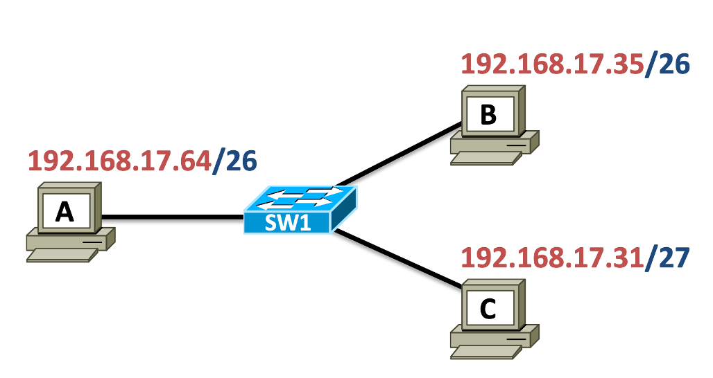
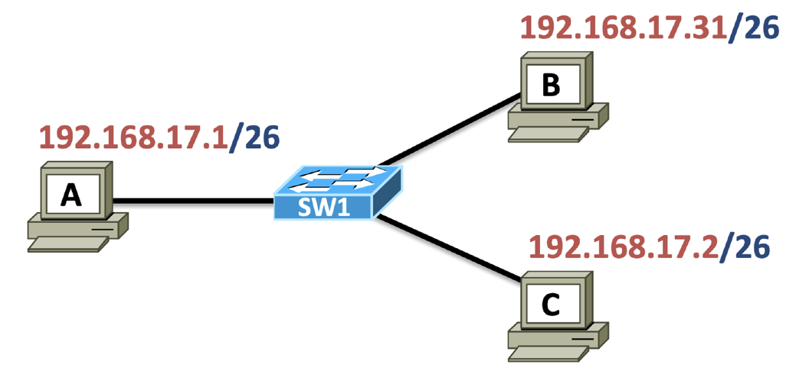

# Nivelul Retea - IP

## Funcțiile nivelului Rețea

- **Adresare globală**
  - Introduce un protocol cu adresare ierarhică numit IP (Internet Protocol).
  - Fiecare dispozitiv este identificat în mod unic la nivel global prin adresa IP.

- **Comunicare end-to-end fără conexiune**
  - Protocoalele nivelului rețea sunt de tip best-effort și nu stabilesc conexiuni.
  - Stabilirea conexiunilor este responsabilitatea protocoalelor de nivel superior.

- **Rutare**
  - Dispozitivele intermediare numite rutere iau decizii de dirijare a traficului în funcție de destinație.

## Protocoale de nivel Rețea

- **Internet Protocol (IP)** – IPv4 / IPv6
- **Network Address Translation (NAT)**
- **(Reverse) Address Resolution Protocol ([R]ARP)**
- **Internet Control Message Protocol (ICMP) + ICMPv6**
- **Internet Group Management Protocol (IGMP)**
- **Internet Protocol Security (IPSec)**

## Internet Protocol (IP)

- Protocolul esențial al Internetului definit în RFC791 (IPv4) în anul 1981.
- Introduce adrese globale pentru rutarea pachetelor de la sursă la destinație.
  - Adrese MAC (nivel 2) – semnificație locală.
  - Adrese IP – semnificație globală (identifică dispozitivul și rețeaua).
- Adaugă informația de adresare prin încapsulare în pachete.
- Dirijarea traficului în Internet se realizează pe baza adresei IP.
- IPv4 este cea mai populară versiune istorică.
- IPv6 rezolvă problema spațiului limitat de adrese și aduce optimizări suplimentare.

## Formatul pachetului IPv4

Structură generală:

- **Version** (4 biți) – valoare fixă 4.
- **Internet Header Length (IHL)** (4 biți) – lungimea header-ului (unități de 32 de biți).
- **Differentiated Service Code Point (DSCP)** (6 biți) – identificarea serviciului pentru QoS.
- **Explicit Congestion Notification (ECN)** (2 biți) – notificarea congestiei.
- **Total Length** (16 biți) – lungimea totală a pachetului (header + date).
- **Identification** (16 biți) – identificatorul unic pentru fragmentare.
- **Flags** (3 biți) – controlul fragmentării:
  - Bit 0: rezervat.
  - Bit 1 (DF): Don't Fragment.
  - Bit 2 (MF): More Fragments.
- **Fragment Offset** (14 biți) – poziția fragmentului în datagramă.
- **Time to Live (TTL)** (8 biți) – numărul maxim de rute prin care poate trece pachetul.
- **Protocol** (8 biți) – protocolul de nivel superior (ex: TCP, UDP).
- **Header Checksum** (16 biți) – verificare a integrității header-ului.
- **Source Address** (32 biți) – adresa IP a sursei.
- **Destination Address** (32 biți) – adresa IP a destinației.
- **Options** – câmp opțional.
- **Data** – datele transportate.

## Formatul pachetului IPv6

Structură generală:

- **Version** (4 biți) – valoare fixă 6.
- **Traffic Class** (8 biți):
  - 6 biți pentru Differentiated Services.
  - 2 biți pentru Explicit Congestion Notification.
- **Flow Label** (20 biți) – identificarea unui flux de comunicație (ex: conexiune TCP).
- **Payload Length** (16 biți) – lungimea totală a datelor și header-elor adiționale.
- **Next Header** (8 biți) – identifică tipul următorului header (ex: TCP, UDP).
- **Hop Limit** (8 biți) – echivalentul TTL-ului din IPv4.
- **Source Address** (128 biți) – adresa IP a sursei.
- **Destination Address** (128 biți) – adresa IP a destinației.

**Note:** Header-ul IPv6 este fix, dar poate indica headere suplimentare.

## Necesitatea unei Adresări Globale

- Adresele MAC sunt eficiente doar local, nu scalează pentru rețele mari.
- Este necesară o adresare ierarhică pentru scalabilitate.
- Exemplu de adresare ierarhică: cod poștal (regiune, sector, stradă).

## Adresa IPv4

- Formatată în 4 octeți, uzual prezentată zecimal punctat.
- Exemplu: `141.85.241.139` → binar: `10001101.01010101.11110001.10001011`.
- Adresa IPv4 are două părți:
  - **Partea de rețea**.
  - **Partea de host**.
- Părțile sunt separate folosind **masca de rețea**.

## Masca de Rețea

- Este un șir de 1 urmat de un șir de 0 (ex: `11111111.11111111.11111111.00000000`).
- Exemplu:
  - `255.255.255.0` ⇔ `/24` (24 biți de 1).
- Notarea `/24` se numește **prefixul rețelei**.
- Reprezentarea completă a unui IP + rețea:
  - `141.85.241.139/24`.

## Adresa de Rețea

- Se obține aplicând **AND binar** între IP și mască.
- Exemplu:
  - IP: `141.85.241.139`
  - Masca: `255.255.255.0`
  - Rezultat: `141.85.241.0` → adresa de rețea.

## Adresa de Loopback

- Interfață virtuală, fără hardware real.
- Adresa de loopback: `127.0.0.1`.
- Testează integritatea stack-ului de protocoale.
- Pachetele trimise către această adresă nu părăsesc stația.
- Utilă pentru testarea aplicațiilor fără conexiune la rețea.

## Exemplu de configurație

- Trei stații: A, B, C.



- Probleme:
  - A are adresă de rețea.
  - C are adresă de broadcast.
  - C are o mască diferită (/27 față de /26).
- Concluzie: configurația este incorectă.

## Exemplu de broadcast



- IP-urile au fost corectate.
- A trimite un broadcast.
- Adrese:
  - Sursă: 192.168.17.1
  - Destinație: 192.168.17.63 (broadcast pentru rețeaua /26)
- Adresa de rețea pentru A: 192.168.17.0

## Adrese publice și private

- RFC1918 definește spațiile de adrese private:
  - 10.0.0.0/8
  - 172.16.0.0/12
  - 192.168.0.0/16
- Adresele private:
  - Nu sunt utilizabile direct în Internet.
  - Necesită traducere NAT pentru acces public.
- Serviciile HTTP pot utiliza un proxy cu adresă publică.

## Clase de adrese

- IPv4 a fost împărțit inițial în 5 clase:
  - A: 0… — mască /8
  - B: 10… — mască /16
  - C: 110… — mască /24
  - D: 1110… — multicast
  - E: 1111… — experimental
- În rețelele moderne clasele nu mai sunt relevante.

## Tabel clase IP

| Clasă | Primul octet | Gama de adrese         | Mască | Scop         |
|------|--------------|------------------------|-------|--------------|
| A    | 0...          | 0.0.0.0 – 127.255.255.255 | /8    | Public       |
| B    | 10...         | 128.0.0.0 – 191.255.255.255 | /16   | Public       |
| C    | 110...        | 192.0.0.0 – 223.255.255.255 | /24   | Public       |
| D    | 1110...       | 224.0.0.0 – 239.255.255.255 | -     | Multicast    |
| E    | 1111...       | 240.0.0.0 – 255.255.255.255 | -     | Experimental |

## Subrețea

### Ce este o subrețea?

O **subrețea** (sau **subnet**) este o porțiune dintr-o rețea IP mai mare, separată logic pentru a organiza mai bine traficul sau dispozitivele.

- Subrețelele permit:
  - Separarea internă a unei rețele în grupuri mai mici.
  - Optimizarea traficului.
  - Management mai ușor al adreselor IP.
  - Creșterea securității rețelei.

---

### Termeni de bază

- **Adresă IP:** Adresa unică a fiecărui dispozitiv (ex: 192.168.1.5).
- **Mască de rețea:** Definirea părții de rețea și părții de host a unei adrese IP.
- **Adresă de rețea:** Prima adresă din subrețea, identifică subrețeaua (toți biții de host sunt 0).
- **Adresă de broadcast:** Ultima adresă din subrețea, folosită pentru a trimite mesaje tuturor dispozitivelor din subrețea (toți biții de host sunt 1).
- **Hosturi utilizabile:** Adresele IP din subrețea care pot fi atribuite dispozitivelor.

---

### Cum calculăm o subrețea? (Metodologie clară)

1. **Cunoști adresa IP și masca de rețea.**
2. **Transformi IP-ul și masca în binar** pentru calcule exacte.
3. **Aplici operația AND** între adresa IP și masca de rețea pentru a afla **adresa de rețea**.
4. **Adresa de broadcast** se obține completând biții de host cu `1`.
5. **Hosturile utilizabile** sunt între adresa de rețea +1 și adresa de broadcast -1.

---

### Exemplu complet

Să luăm exemplul:  
Adresă IP: **192.168.1.130**  
Mască de rețea: **255.255.255.192** (adică /26)

**Pas 1: Convertim în binar**

- IP:  
  `192.168.1.130` → `11000000.10101000.00000001.10000010`
- Masca:  
  `255.255.255.192` → `11111111.11111111.11111111.11000000`

**Pas 2: Operație AND pentru adresa de rețea**

AND între IP și mască:

```
11000000.10101000.00000001.10000010
AND
11111111.11111111.11111111.11000000
=
11000000.10101000.00000001.10000000
```

Adică **192.168.1.128**.

**Deci adresa de rețea este:**  
**192.168.1.128/26**

**Pas 3: Calculăm adresa de broadcast**

- Adresa de broadcast:  
  Luăm adresa de rețea și punem `1` pe toți biții de host.
- Pentru /26: ultimii 6 biți sunt host.
- `192.168.1.191` este adresa de broadcast.

**Pas 4: Calculăm hosturile utilizabile**

- Primul host: `192.168.1.129`
- Ultimul host: `192.168.1.190`
- Număr total de hosturi utilizabile: **62** (2⁶ - 2)

---

### Recapitulare

| Element                  | Valoare                  |
|---------------------------|---------------------------|
| IP                        | 192.168.1.130             |
| Mască                     | 255.255.255.192 (/26)     |
| Adresă de rețea            | 192.168.1.128             |
| Adresă de broadcast       | 192.168.1.191             |
| Hosturi utilizabile        | 192.168.1.129 - 192.168.1.190 |

---

### Observații

- **/24** → 255.255.255.0 → 254 hosturi disponibile.
- **/26** → 255.255.255.192 → 62 hosturi disponibile.
- **/30** → 255.255.255.252 → 2 hosturi disponibile (ideal pentru punct-la-punct).
- Se scad 2 adrese: una rezervată pentru **adresa de rețea** și una pentru **broadcast**.

## Exercițiu de împărțire în subrețele

### Cerință

Se cere să se împartă spațiul de adrese **192.168.10.0/24** pentru a suporta trei rețele, fiecare având:

- 60 stații
- 30 stații
- 15 stații

Subrețelele trebuie să fie **egale ca dimensiune**.

---

### Rezolvare

**Pasul 1: Câți biți trebuie împrumutați?**

- Din /24 avem 8 biți disponibili pentru partea de host.
- Trebuie să împărțim în cel puțin 3 subrețele.
- 2 biți împrumutați generează 2² = **4 subrețele** (suficient pentru 3 rețele).

Prin urmare, noul prefix va fi **/26**.

---

**Pasul 2: Câți hosturi sunt disponibile într-o subrețea /26?**

- 6 biți pentru host → 2⁶ = 64 adrese totale.
- Se scad 2 adrese rezervate (adresa de rețea și adresa de broadcast).
- Rămân **62 hosturi utilizabile** per subrețea.

---

**Pasul 3: Verificăm dacă putem susține numărul de stații:**

- Pentru 60 de hosturi → necesar minim 62 hosturi → OK.
- Pentru 30 de hosturi → necesar minim 30 hosturi → OK.
- Pentru 15 hosturi → necesar minim 15 hosturi → OK.

**Observație:**  
Împărțim în subrețele egale, deci fiecare subrețea poate conține până la **62 hosturi utilizabile**, chiar dacă unii nu vor fi folosiți.

---

### Alocarea subrețelelor

| Subnet          | Adresă de rețea         | Mască         | Hosturi utilizabile            |
|-----------------|--------------------------|---------------|--------------------------------|
| Subnet 1        | 192.168.10.0/26           | 255.255.255.192 | 192.168.10.1 – 192.168.10.62   |
| Subnet 2        | 192.168.10.64/26          | 255.255.255.192 | 192.168.10.65 – 192.168.10.126 |
| Subnet 3        | 192.168.10.128/26         | 255.255.255.192 | 192.168.10.129 – 192.168.10.190 |

---

### Cât de multe adrese IP de stații au fost risipite?

Calculăm pentru fiecare subrețea:

- Subnet 1: 62 - 60 = **2 adrese risipite**
- Subnet 2: 62 - 30 = **32 adrese risipite**
- Subnet 3: 62 - 15 = **47 adrese risipite**

**Total adrese risipite:**  
`2 + 32 + 47 = 81 adrese risipite`

---

### Recapitulare cheie

| Noțiune                    | Valoare                         |
|-----------------------------|----------------------------------|
| Adresă inițială             | 192.168.10.0/24                 |
| Noul prefix                 | /26                             |
| Hosturi disponibile/subrețea | 62 hosturi utilizabile          |
| Număr de subrețele create    | 4 (din care folosim 3)           |
| Adrese risipite              | 81 adrese                       |

---

### Observație suplimentară

Ultima subrețea creată (192.168.10.192/26) rămâne **neutilizată** în acest caz, deoarece aveam nevoie doar de 3 subrețele.

## Exercițiu de împărțire în subrețele

### Cerință

Împărțirea spațiului de adrese **172.18.240.0/23** pentru a satisface următoarele cerințe:

- 1 rețea cu 200 hosturi
- 1 rețea cu 90 hosturi
- 2 rețele cu 20 hosturi
- 1 rețea cu 6 hosturi
- 3 rețele cu 4 hosturi

---

## Rezolvare

**Pasul 1: Înțelegem adresa inițială**

- **/23** înseamnă că avem **32 - 23 = 9 biți** pentru hosturi.
- Număr total adrese: **2⁹ = 512 adrese**.
- Număr hosturi utilizabile: **512 - 2 = 510 hosturi**.

Avem deci destule adrese pentru toate cerințele.

---

**Pasul 2: Împărțim în ordinea descrescătoare a nevoii de hosturi**

| Cerință            | Hosturi necesare | Puterea lui 2 necesară | Prefix nou |
|--------------------|------------------|------------------------|------------|
| Rețea 1            | 200              | 256 (2⁸)               | /24        |
| Rețea 2            | 90               | 128 (2⁷)               | /25        |
| Rețea 3 și 4       | 20 fiecare       | 32 (2⁵)                | /27        |
| Rețea 5            | 6                | 8 (2³)                 | /29        |
| Rețea 6, 7 și 8    | 4 fiecare        | 8 (2³)                 | /29        |

Explicație:

- De fiecare dată alegem **cea mai mică putere a lui 2** care acoperă numărul de hosturi, ținând cont că scădem 2 adrese (rețea și broadcast).

---

**Pasul 3: Alocăm subrețelele**

1. **Rețea 1** (200 hosturi):
   - Subnet: **172.18.240.0/24**  
   - Hosturi: 172.18.240.1 – 172.18.240.254

2. **Rețea 2** (90 hosturi):
   - Subnet: **172.18.241.0/25**  
   - Hosturi: 172.18.241.1 – 172.18.241.126

3. **Rețea 3** (20 hosturi):
   - Subnet: **172.18.241.128/27**  
   - Hosturi: 172.18.241.129 – 172.18.241.158

4. **Rețea 4** (20 hosturi):
   - Subnet: **172.18.241.160/27**  
   - Hosturi: 172.18.241.161 – 172.18.241.190

5. **Rețea 5** (6 hosturi):
   - Subnet: **172.18.241.192/29**  
   - Hosturi: 172.18.241.193 – 172.18.241.198

6. **Rețea 6** (4 hosturi):
   - Subnet: **172.18.241.200/29**  
   - Hosturi: 172.18.241.201 – 172.18.241.206

7. **Rețea 7** (4 hosturi):
   - Subnet: **172.18.241.208/29**  
   - Hosturi: 172.18.241.209 – 172.18.241.214

8. **Rețea 8** (4 hosturi):
   - Subnet: **172.18.241.216/29**  
   - Hosturi: 172.18.241.217 – 172.18.241.222

---

## Observații importante

- De fiecare dată **adresele trebuie să fie alocate de la mic la mare**.
- Nu există suprapuneri între adrese.
- Am folosit **VLSM** (Variable Length Subnet Masking) pentru a aloca eficient spațiul.

---

## Recapitulare tabelară

| Rețea  | Prefix         | Hosturi utilizabile          |
|--------|----------------|-------------------------------|
| Rețea 1 | 172.18.240.0/24 | 172.18.240.1 – 172.18.240.254 |
| Rețea 2 | 172.18.241.0/25 | 172.18.241.1 – 172.18.241.126 |
| Rețea 3 | 172.18.241.128/27 | 172.18.241.129 – 172.18.241.158 |
| Rețea 4 | 172.18.241.160/27 | 172.18.241.161 – 172.18.241.190 |
| Rețea 5 | 172.18.241.192/29 | 172.18.241.193 – 172.18.241.198 |
| Rețea 6 | 172.18.241.200/29 | 172.18.241.201 – 172.18.241.206 |
| Rețea 7 | 172.18.241.208/29 | 172.18.241.209 – 172.18.241.214 |
| Rețea 8 | 172.18.241.216/29 | 172.18.241.217 – 172.18.241.222 |

---

## Rezumat

- **Spațiul inițial**: 172.18.240.0/23 (510 hosturi)
- **Cerințe acoperite**: 200 + 90 + 20 + 20 + 6 + 4 + 4 + 4 = 348 hosturi
- **Adrese neutilizate**: 510 - 348 = **162 adrese disponibile** (pot fi folosite ulterior).
