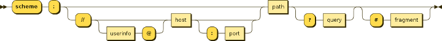
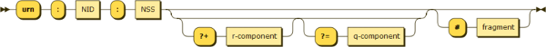

# Nivelul Aplicatie: HTTP(S) si Web Sockets

- Protocol de nivel aplicatie -> Funtioneaza in maniera cerere - raspuns

- Datele sunt transmise in mod mix:
  - Antete - text
  - Corp - binar

## Comunicarea asincrona

- Sesiunea HTTP este formate din cererea clientului si raspunsul serverului

- NU se mentine starea intre cereri succesive

## Scheme de localizare

1. URI (Uniform Resource Identifieer)

    - Indetificatorul unic al unei resurse: URL + URN

2. URL (Uniform Resource Locator)

    - Locatia unica a unei resurse de forma:

    

3. URN (Uniform Resource Name)

    - Numele unic a unei resurse de forma:

    

## Cererea HTTP

- O linie de cerere care specifica metoda si adresa resursei

- Un numar oarecare de antete

- O linie goala

- Optional: un cor de request

### Metode HTTP

1. `GET`: întoarce conținutul unei resurse identificată printr-un URL;
2. `POST`: se folosește pentru a trimite date către server;
3. `PUT`: solicită salvarea entității trimise pe server la o adresă URL;
4. `PATCH`: aplică modificări parțiale asupra unei resurse;
5. `DEETE`: solicită ștergerea entității identificate printr-un URL;
6. `HEAD`: verifică existența unei entități fără o întoarce conținut;
7. `TRACE`: permite clientului să verifice cum sunt recepționate datele în scopul testării și diagnosticării recepției;
8. `CONNECT`: se folosește în combinație cu proxy pentru a realiza în mod automat un tunel;
9. `OPTIONS`: se utilizează pentru a obține informații privind modul cum se va realiza comunicarea cu resursa destinație.

## Antete HTTP

1. Contextul cererii:
    - Host: numele sau adresa mașinii căreia îi este adresată cererea;
    - Referer: pagina anterioară care a declanșat navigarea la resursa curent solicitată;
    - User-Agent: descrie aplicația și mediul de execuție care a trimis cererea;
    - Autentificare:

2. WWW-Authenticate: definește modul de autentificare pentru accesul la resurse;
    - Authorization: precizează credențialele de acces;
    - Proxy-Autehnticate: definește modul de autentificare cerut de proxy;
    - Proxy-Authorization: credențialele pentru acces prin proxy.

3. Informații despre corpul mesajului:
    - Accept-Ranges: unitatea de măsură pentru dimensiunea corpului mesajului;
    - Content-Length: dimensiunea corpului mesajului;
    - Content-Type: tipul resursei conform standardului MIME;
    - Content-Encoding: codificarea corpului mesajului;
    - Content-Language: limba în care este scris conținutul mesajului;
    - Content-Location: indica o adresă alternative a resursei solicitate.

4. Redirectare:
    - Location: URL-ul la care este disponibilă resursa solicitată.

## Raspunsul HTTP

- O linie de status, conținând codul de răspuns și justificarea (corespunde codului);

- Un număr de headere de răspuns;

- O linie goală;

- Opțional, un corp de răspuns.

## Standardul MIME

- MIME = Multipurpose Internet Mail Extensions defineste clase si subclase pentru tipurile resurselor livrate

- Serverul si browserul folosesc aceste etichete penbtru a utiliza in mod corespunzator resursele primite

## Cookies

- Serverul seteaza cookie-uri pe client trimitand in raspuns antetul `set-cookie`

1. Session Cookie - identifica sesiunea curenta fiind sters la finalul ei

2. Persisten Cookie - valid si dupa expirarea sesiunii curente

3. Secure cookie - are setat atributul de Securitatea fiind folosite cu HTTPS

4. HttpOnly Cookie - nu este accesibil de client din JS

5. Super Cookie - are originea intr-un domeniu din radacina domeniilor Internet (.com)

## Web Sockets

- Obiecte de tip `window.WebSocket` fara a necesita plugin

- Se stabileste o conexiune pe sockete pe care se trimite o cerere HTTP

- Se schimba protocolul din HTTP intr-unul la nivel de socket

- Se pot trimite mesaje in ambele directii simultant

## HTTPS

- HTTP over TLS

- TLS = actioneaza ca un subnivel HTTP-ului

- HTTPS cripteaza un mesaj HTTP inainte de a transmite si descripteaza mesajul la sosire

- HTTPS utilieaza 443, iar HTTP 80

- Tranzacțiile TLS sunt negociate cu ajutorul unui algoritm de criptare bazat pe cheie între client și server, această cheie are o lungime de 40 sau 128 de biți (cu cât numărul de biți este mai mare, cu atât criptarea este mai sigură).

## Handskae TLS

- O conexiune TLS peste HTTP este întotdeauna inițiată de client folosind o adresă URL care începe cu https: // în loc de http: //;
- La începutul unei sesiuni TLS, se realizează un handshake TLS, având ca rezultat stabilirea parametrilor criptografici ai sesiunii:
  - Browser-ul emite o solicitare sigură;
  - Server-ul trimite certificatul X.509 care conține cheie publică;
  - Browser-ul autentifică certificatul cu lista CA-urilor cunoscute (Certificate Authority);
  - Dacă un CA nu este cunoscut, browser-ul poate oferi utilizatorului opțiunea de a accepta certificatul pe riscul său;
  - Browser-ul generează cheie simetrică aleatorie și o criptează folosind cheia publică a server-ului;
  - Browser-ul și server-ul cunosc acum ambele chei simetrice și criptează datele utilizatorului final folosind cheile simetrice pe durata sesiunii.
